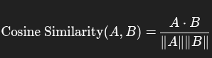

# Embedding Models

Algorithms to convert high dimensional data into lower-dimensional vector representation.

## How it works?

### 1.Input and Tokenization

Input is broken down into smaller chunks called tokens. Each token assigned with an unique ID.

### 2.Neural Network Processing

IDs are passed through a neural network which are commonly **BERT** or **GPT**. The network has learned patterns from reading billions of sentences. It looks at the context of each token (the words surrounding it) to determine its specific meaning in that sentence.

### 3.Vector Output

The model outputs a fixed-size array of floating-point numbers.

- Dimensions: Common dimensions are 768, 1536, or 3072.
- Example: The word “Apple” might look like this to the machine:
[0.02, -0.15, 0.88, ... 0.04]

### 4.Comparing Vectors

Using cosine similarity to measure similarity on [-1,1] range.

## How does the transformers work?

### Tokenization

Every model has a dictionary that maps words to integers. The raw text is tokenized and given to this custom dictionary.

Example: The heavy metal

- The - ID: 101
- heavy - ID: 2045
- metal - ID: 3492

### Initial Embedding Layer

At the entrance of the neural network is a giant matrix that holds a starter vector for every word in the dictionary.

The vector for “metal” here is a generic mix of “shiny material” and “music genre.” It doesn’t know which one it is yet.

Example :

ID(3492)→[0.1,−0.5,0.2,...]

### Self Attention

Every word in the sentence looks at the other words vectors. The vector passes through transformer layers.

The “Metal” Example:
The model analyzes the word “metal”:

- It looks at its neighbor: “heavy”.
- The model has learned during training that “heavy” + “metal” usually refers to music, not construction materials.
- The Math: The vector for “metal” is mathematically updated. It shifts its values.
- Before Attention: The vector points loosely towards “Iron/Steel”.
- After Attention: The vector rotates to point towards “Rock Music/Guitar”.

### Pooling

Turn word vectors into a single vector. This process is called pooling.

The most common pooling is **Mean Pooling** where we take the mean of all word vectors.

