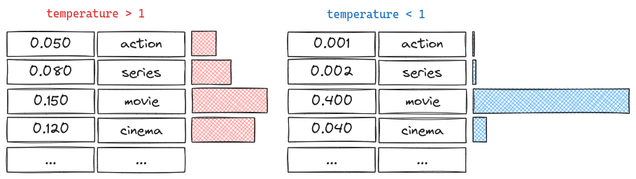

# Model Structures

## Choosing Output

When an LLM processes an input, it does not simply output a single word. Instead, it generates a probability distribution over every single token in its entire vocabulary which can be tens of thousands of tokens.

### Greedy Approach

The most straightforward method is the Greedy approach. In this method, the model looks at the probability list and always selects the single token with the highest probability.

### Random Sampling

To solve the problems of repetition and lack of creativity found in the Greedy approach, we use Random Sampling.

In this method, the model does not strictly pick the top number. Instead, it “rolls the dice” to pick a token, but the dice are weighted based on the probability distribution.

---
## Filtering Technique

### Top-K & Top-P

Choosing only the **top k elements** or the **top elements with the sum of p percent**.

## Scaling Technique

### Temperature

Temperature is a hyperparameter that controls the randomness and creativity of the model’s output. While strategies like Greedy Decoding or Random Sampling determine how we pick a token from a list, Temperature actually changes the numbers (probabilities) inside that list before a choice is made.

- **Low Temperature**: The model becomes conservative, predictable, and factual. 
- **High Temperature**: The model becomes creative, diverse, and unpredictable.

- **Low Temp Usage**: Fact retrieval, QA, Coding.
- **High Temp Usage**: Creative writing, Poetry, Brainstorming.

| Goal | Recommended Temperature | Why? |
| :--- | :--- | :--- |
| **Math / Coding / Facts** | Low (0.0 - 0.2) | You need precision. There is usually only one correct answer. |
| **General Chat** | Medium (0.5 - 0.7) | A balance between coherence and sounding natural. |
| **Poetry / Brainstorming** | High (0.8 - 1.0+) | You want unique ideas and are willing to accept some mistakes. |

