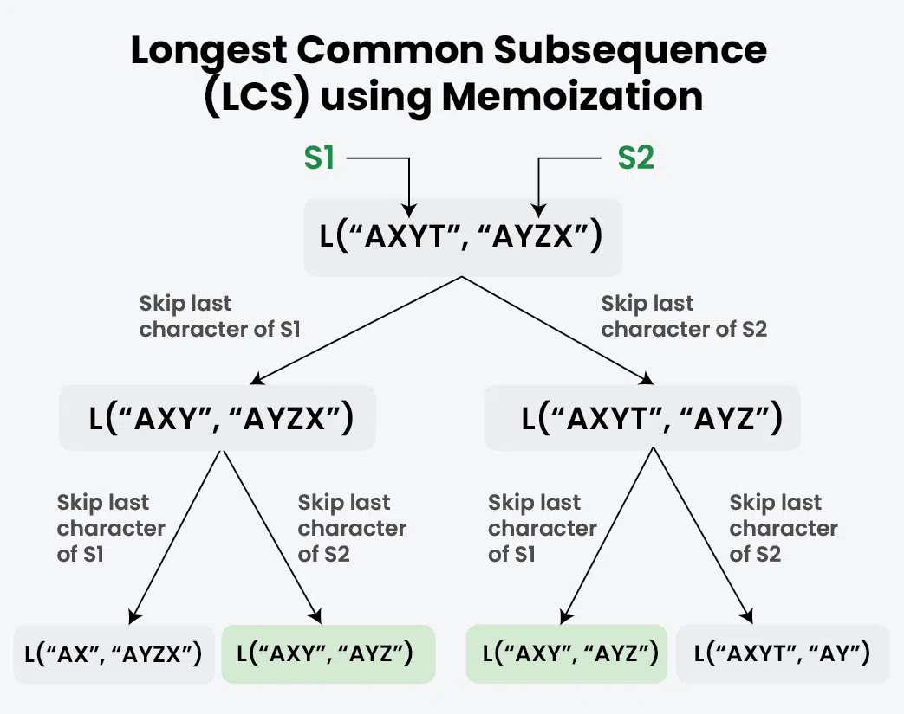
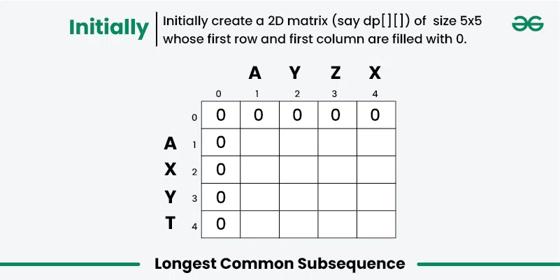
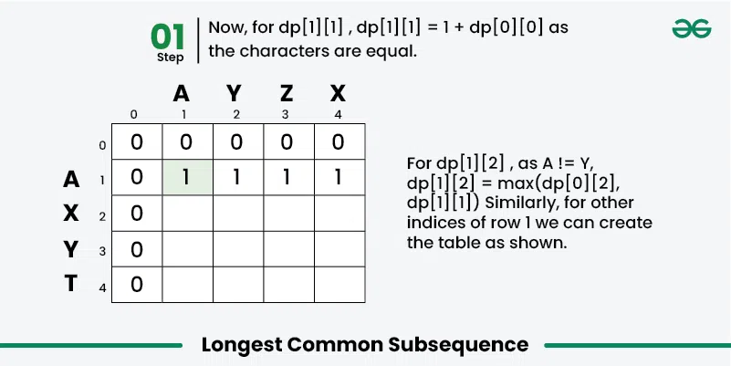
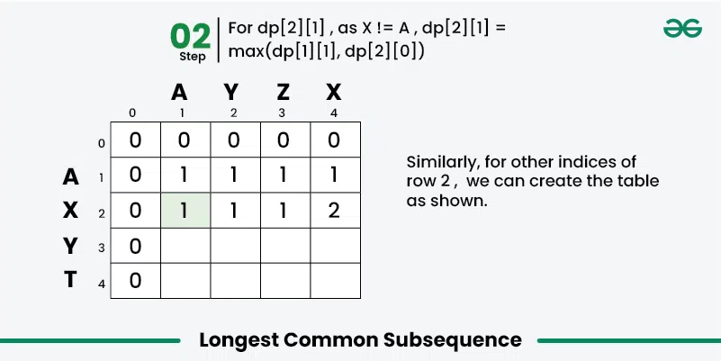
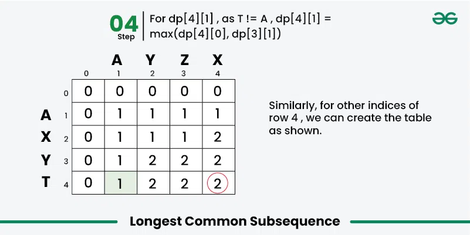

# Dynamic Programming (DP)

Most common way to solve these is to first solve with recursion and then go to DP from that recursion it makes it easier.

## Example: Solving the Longest Common Subsequence problem

Given two strings, s1 and s2, the task is to find the length of the Longest Common Subsequence. If there is no common subsequence, return 0. A subsequence is a string generated from the original string by deleting 0 or more characters, without changing the relative order of the remaining characters.

```text
Input: s1 = "ABC", s2 = "ACD"
Output: 2
Explanation: The longest subsequence which is present in both strings is "AC".

Input: s1 = "AGGTAB", s2 = "GXTXAYB"
Output: 4
Explanation: The longest common subsequence is "GTAB".

Input: s1 = "ABC", s2 = "CBA"
Output: 1
Explanation: There are three longest common subsequences of length 1, "A", "B" and "C".
```

### Answer using recursion - O(2 ^ min(m, n)) Time and O(min(m, n)) Space



```Python
# A Naive recursive implementation of LCS problem

# Returns length of LCS for s1[0..m-1], s2[0..n-1]
def lcsRec(s1, s2, m, n):
  
    # Base case: If either string is empty, the length of LCS is 0
    if m == 0 or n == 0:
        return 0

    # If the last characters of both substrings match
    if s1[m - 1] == s2[n - 1]:

        # Include this character in LCS and recur for remaining substrings
        return 1 + lcsRec(s1, s2, m - 1, n - 1)

    else:
        # If the last characters do not match
        # Recur for two cases:
        # 1. Exclude the last character of S1 
        # 2. Exclude the last character of S2 
        # Take the maximum of these two recursive calls
        return max(lcsRec(s1, s2, m, n - 1), lcsRec(s1, s2, m - 1, n))

def lcs(s1,s2):
    m = len(s1)
    n = len(s2)
    return lcsRec(s1,s2,m,n)

if __name__ == "__main__":
    s1 = "AGGTAB"
    s2 = "GXTXAYB"
    print(lcs(s1, s2))
```

### Expected Answer using DP - Bottom-Up DP (Tabulation) - O(m * n) Time and O(m * n) Space







```python
def lcs(S1, S2):
    m = len(S1)
    n = len(S2)

    # Initializing a matrix of size (m+1)*(n+1)
    dp = [[0] * (n + 1) for x in range(m + 1)]

    # Building dp[m+1][n+1] in bottom-up fashion
    for i in range(1, m + 1):
        for j in range(1, n + 1):
            if S1[i - 1] == S2[j - 1]:
                dp[i][j] = dp[i - 1][j - 1] + 1
            else:
                dp[i][j] = max(dp[i - 1][j],
                               dp[i][j - 1])

    # dp[m][n] contains length of LCS for S1[0..m-1]
    # and S2[0..n-1]
    return dp[m][n]


if __name__ == "__main__":
    S1 = "AGGTAB"
    S2 = "GXTXAYB"
    print(lcs(S1, S2))
```