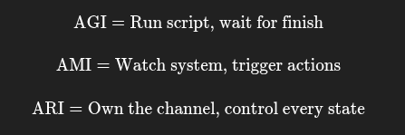

Computer-Telephony Integration (CTI)

Technology that allows computers to interact with, control and manage telephone systems.

In asterisk, CTI is achieved through 3 distinct interfaces and one file based mechanism.

- AGI
- AMI
- ARI
- Outbound Call Spooling

## AGI (Asterisk Gateway Interface)

Analogous to CGI (Common Gateway Interface) in web servers. Allows astersik to run a script on the active call.

- A call arrives in the Asterisk Dialplan.
- Asterisk executes the `AGI()` application.
- Asterisk launches your script (written in Python, PHP, Perl, C, etc.).
- Communication happens via `stdin` (Standard Input) and `stdout` (Standard Output).
- Asterisk sends call details (Caller ID, Channel) to the script via stdin.
- The script sends commands (e.g., “Play file”, “Get Input”) to Asterisk via stdout.
- When the script finishes, control returns to the Asterisk Dialplan.

### Use Cases

- **Database Lookups**: Checking a CRM to see if a caller is a VIP based on their phone number.
- **Complex Logic**: Mathematical calculations or API calls that are too hard to do in the native Dialplan language.
- **Dynamic IVR**: generating menus based on user data.


## AMI (Asterisk Manager Interface)

An asynchronous, TCP-based interface for system management and monitoring. AGI is one-to-one meaning one script per call but AMI allows client to connect to Asterisk and see everything happening on the system.

- A client application connects to Asterisk on TCP port 5038.
- The client logs in with a username and secret.
- **Events**: Asterisk pushes data to the client whenever something happens (e.g., NewChannel, Hangup, PeerStatus).
- **Actions**: The client sends commands to Asterisk (e.g., Originate to start a call, Redirect to transfer a call).

### Use Cases

- Operator Panels: Software that shows a receptionist who is on the phone.
- Click-to-Dial: Clicking a number in a web browser that triggers the desk phone to dial.
- Call Recording Management: Triggering recording on/off externally.


## ARI (Asterisk REST Interface)

Designed for builiding custom communication applications. ARI exposes the raw telephony primitives like Channels, Bridges, Endpoints, Recordings via a REST API and Websockets.

It allows the developer to replece the `extensions.conf` (Dialplan) almost entirely and manage the call state engine in their own external application. 

- **Stasis**: In the Asterisk Dialplan, you send a call to a generic application called `Stasis`.
- **WebSocket**: Your external application receives a WebSocket event saying “A channel entered Stasis.”
- **REST API**: Your application issues HTTP PUT/POST/DELETE commands to control that channel (e.g., POST /channels/{id}/play).

### Use Cases

- Custom Queuing Systems: Building a call center logic that doesn’t fit standard FIFO queues.
- Conference Bridges: Creating custom video/audio conference rooms with specific mute/unmute logic.
- Voice Bots: Real-time integration with AI Speech-to-Text engines.



## Outbound Call Spooling

Simple Autodialer

Simplest form of CTI. Does not require a socket connection or a programming interface. It relies on the filesystem. Used to automatically initiate calls.

- You generate a text file (formatted like an INI file) containing details of the call (who to call, and what to do when they answer).
- You update the file’s timestamp to the future if you want to schedule the call.
- You move (not copy) the file into the spool directory: `/var/spool/asterisk/outgoing/`.
- Asterisk’s internal engine detects the file, parses it, and immediately dials.

Code Example:

```text
Channel: PJSIP/1001
MaxRetries: 2
RetryTime: 60
WaitTime: 30
Context: from-internal
Extension: 600       ; Assuming 600 is the Sales Queue
Priority: 1
Callerid: "Wake Up Call" <555>
```

Script to trigger the call

```shell
#!/bin/bash

# Write the call file to a temporary location
cat <<EOF > /tmp/callback.call
Channel: PJSIP/205
Application: Playback
Data: hello-world
EOF

# Move it to the spool directory to trigger the call
mv /tmp/callback.call /var/spool/asterisk/outgoing/
```
