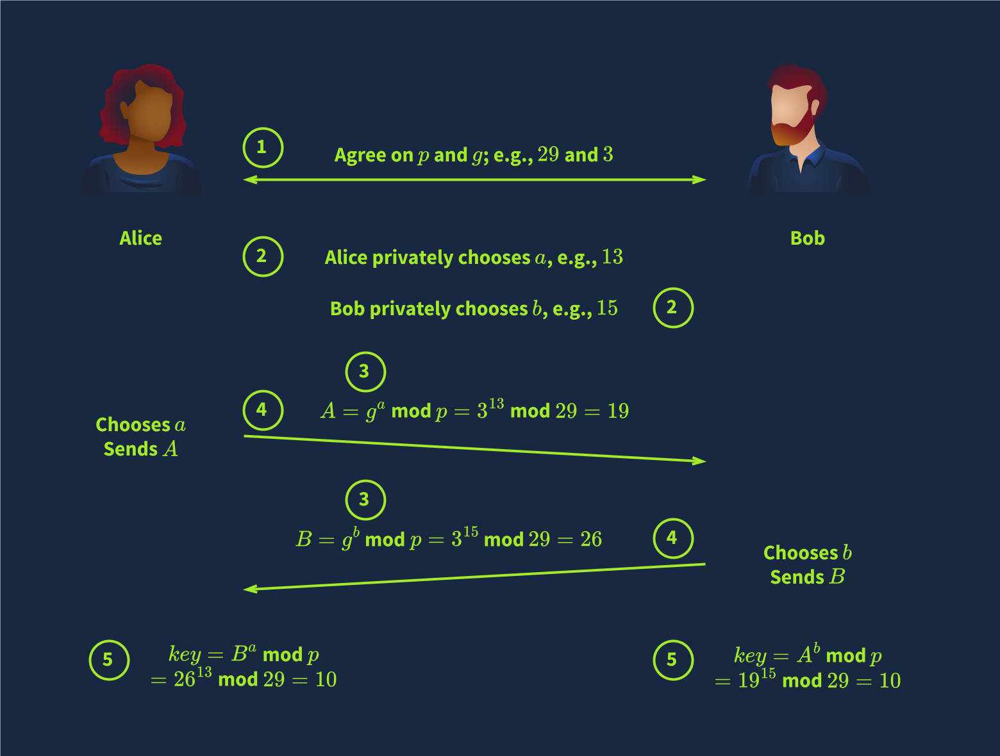

# Diffie-Hellman Key Exchange

One of the challenges of using symmetric encryption is sharing the secret key. 

## Key Exchange

Key exchange aims to establish a shared secret between two parties. It is a method that allows two parties to establish a shared secret over an insecure communication channel without requiring a pre-existing shared secret and without an observer being able to get this key. Consequently, this shared key can be used for symmetric encryption in subsequent communications.

