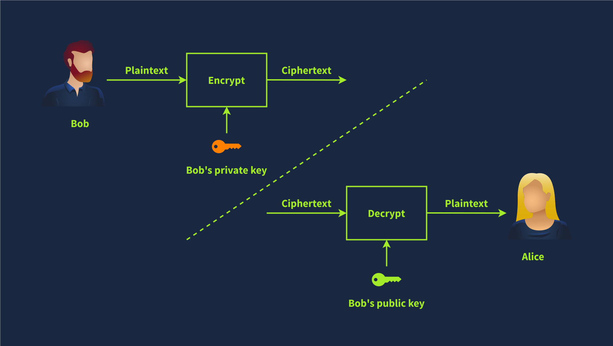

# Digital Signatures

Digital signatures provide a way to verify the authenticity and integrity of a digital message or document. 

Using asymmetric cryptography, you produce a signature with your private key, which can be verified using your public key.Only you should have access to your private key, which proves you signed the file. In many modern countries, digital and physical signatures have the same legal value.

The simplest form of digital signature is encrypting the document with your private key. If someone wants to verify this signature, they would decrypt it with your public key and check if the files match. This process is shown in the image below.

## Certificates

How does the browser know that it is communicating with the real server?

Installing a Root Certificate Authority(CA) on system. Certificates are only trusted when the CA says they trust an organization. An CA's then should be trusted by the browser.

Let’s say you have a website and want to use HTTPS. This step requires having a TLS certificate. You can get one from the various certificate authorities for an annual fee. Furthermore, you can get your own TLS certificates for domains you own using Let's Encrypt for free. If you run a website, it’s worth setting up and switching to HTTPS, as any modern website would do.