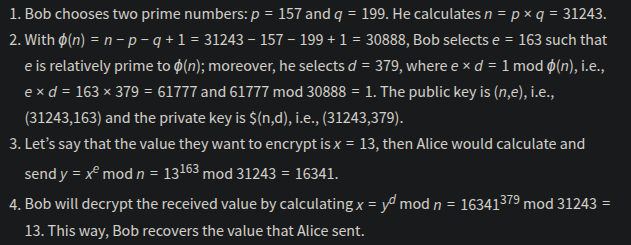

# RSA

RSA is a public-key encryption algorithm that enables secure data transmission over insecure channels.

It is based on the mathematically difficult problem of factoring a large number. Computer cannot factorise a number with more than 600 digits.

## Numerical Example

Public key is known to all correspondents and is used for encryption.
While private key is used for encryption.

IRL the p and q would be more than 300 digits.

- p and q are large prime numbers
- n is the product of p and q
- The public key is n and e
- The private key is n and d
- m is used to represent the original message, i.e., plaintext
- c represents the encrypted text, i.e., ciphertext