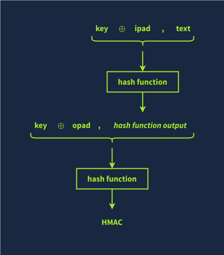

# HMAC

Keyed-Hashed Message Authenticity Code is a type of MAC that uses a cryptographic hash function and a secret-key to verify authenticity and integrity of the data

- The secret key is padded to the block size of the hash function.
- The padded key is XORed with a constant (usually a block of zeros or ones).
- The message is hashed using the hash function with the XORed key.
- The result from Step 3 is then hashed again with the same hash function but using the padded key XORed with another constant.
- The final output is the HMAC value, typically a fixed-size string.

