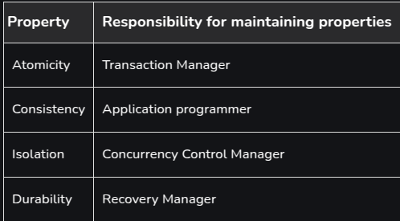

# ACID

A transaction is a single logical unit of work that interacts with the database, potentially modifying its content through read and write operations. To maintain database consistency both before and after a transaction, specific properties, known as ACID properties must be followed.

## Atomicity

By this, we mean that either the entire transaction takes place at once or doesn’t happen at all. There is no midway i.e. transactions do not occur partially. Each transaction is considered as one unit and either runs to completion or is not executed at all. It involves the following two operations.

- **Abort**: If a transaction aborts, changes made to the database are not visible.
- **Commit**: If a transaction commits, changes made are visible.

Atomicity is also known as the ‘All or nothing rule’.

Why should we have this?

If the transaction fails after completion of T1 but before completion of T2 ( say, after write(X) but before write(Y) ), then the amount has been deducted from X but not added to Y . This results in an inconsistent database state. Therefore, the transaction must be executed in its entirety in order to ensure the correctness of the database state.

## Consistency

Consistency ensures that a database remains in a valid state before and after a transaction. It guarantees that any transaction will take the database from one consistent state to another, maintaining the rules and constraints defined for the data.
Referring to the example above,
The total amount before and after the transaction must be maintained.
Total before T occurs = 500 + 200 = 700 .
Total after T occurs = 400 + 300 = 700 .
Therefore, the database is consistent . Inconsistency occurs in case T1 completes but T2 fails.

## Isolation
This property ensures that multiple transactions can occur concurrently without leading to the inconsistency of the database state. Transactions occur independently without interference. Changes occurring in a particular transaction will not be visible to any other transaction until that particular change in that transaction is written to memory or has been committed. This property ensures that when multiple transactions run at the same time, the result will be the same as if they were run one after another in a specific order.
Let X = 500, Y = 500.
Consider two transactions T and T”.

Suppose T has been executed till Read (Y) and then T’’ starts. As a result, interleaving of operations takes place due to which T’’ reads the correct value of X but the incorrect value of Y and sum computed by
T’’: (X+Y = 50, 000+500=50, 500) .
is thus not consistent with the sum at end of the transaction:
T: (X+Y = 50, 000 + 450 = 50, 450) .
This results in database inconsistency, due to a loss of 50 units. Hence, transactions must take place in isolation and changes should be visible only after they have been made to the main memory.

## Durability

This property ensures that once the transaction has completed execution, the updates and modifications to the database are stored in and written to disk and they persist even if a system failure occurs. These updates now become permanent and are stored in non-volatile memory. The effects of the transaction, thus, are never lost.

