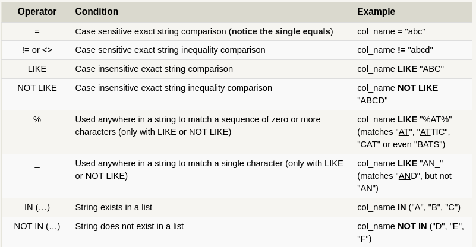

# Constraints

Select query with constraints.

```sql
SELECT column, another_column, …
FROM mytable
WHERE condition
    AND/OR another_condition
    AND/OR …;
```




# Filtering  and Sorting

- **DISTINCT**: This keyword will retrieve only unique records.
- **ORDER BY**: This keyword is used to sort the result-set in ascending or descending order.

```sql
SELECT column, another_column, …
FROM mytable
WHERE condition(s)
ORDER BY column ASC/DESC;
```

- **LIMIT**: This keyword will limit the number of records returned in the result set.

```sql
SELECT column, another_column, …
FROM mytable
WHERE condition(s)
ORDER BY column ASC/DESC
LIMIT num_limit OFFSET num_offset;
```