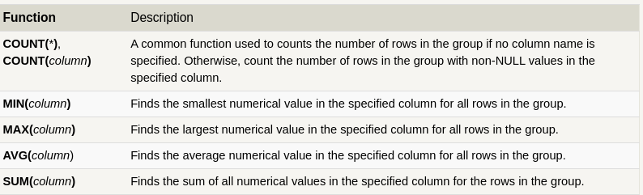
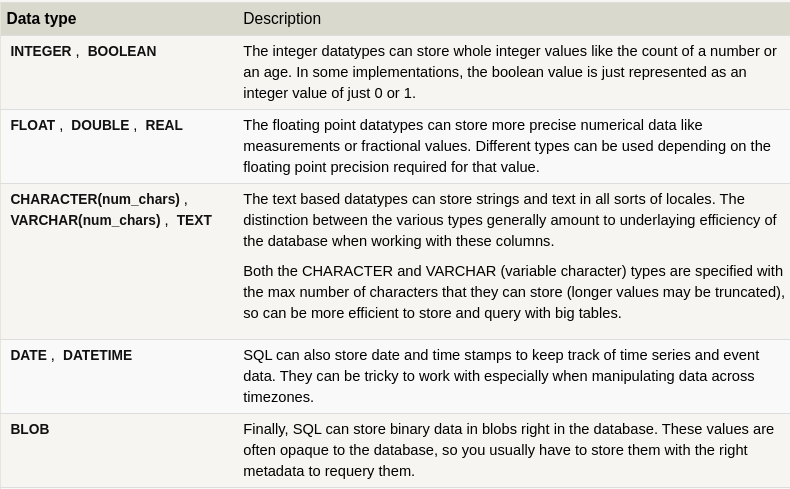
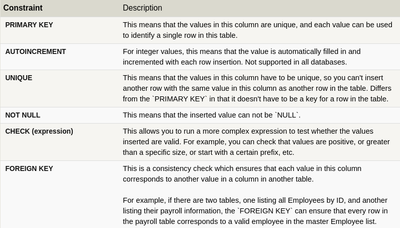

# SQL

## What is SQL?

SQL is a standard query language used to access and manipulate data in databases. SQL stands for Structured Query Language. We can create, update, delete, and retrieve data in databases like MySQL, Oracle, PostgreSQL, etc. Overall, SQL is a query language that communicates with databases.

## What is a query in SQL?

A query in SQL (Structured Query Language) is a request made to a database to retrieve or manipulate data. It consists of a set of instructions to perform tasks such as fetching, updating, deleting, or inserting data into the database.

## Constraints in SQL

Constraints act as rules or conditions imposed on the data, dictating what values are permissible and what actions can be taken. They play a crucial role in maintaining the quality and coherence of the database by preventing errors. So, explore this section to get a hand on SQL Data Constraints.

- NOT NULL Constraints
- Primary Key Constraints
- Foreign Key Constraints
- Composite Key
- Unique Constraints
- Alternate Key
- CHECK Constraints
- DEFAULT Constraints

### Example of Constraints

```sql
CREATE TABLE table_Name
(
column1 data_type(size) NOT NULL,
column2 data_type(size) NOT NULL,
);

```

PRIMARY KEY in SQL is a column (or group of columns) that uniquely identifies the records in that table. A primary key must contain unique values and can not have any NULL value.

There can only be one primary key in a table, but that primary key can consist of one or more columns. When there are two or more columns in the primary key it is called a composite key.

A primary key automatically has a UNIQUE constraint defined on it, and it ensures that there are no duplicate or NULL values in that column.

```sql
CREATE TABLE table_name (
 column1 datatype constraint,
 column2 datatype constraint,
 CONSTRAINT pk_constraint_name PRIMARY KEY (column1, column2, …)
);
```

## JOINS And Normalization

### INNER JOIN

The INNER JOIN is a process that matches rows from the first table and the second table which have the same key (as defined by the ON constraint) to create a result row with the combined columns from both tables. After the tables are joined, the other clauses we learned previously are then applied.

```sql
SELECT column, another_table_column, …
FROM mytable
INNER JOIN another_table 
    ON mytable.id = another_table.id
WHERE condition(s)
ORDER BY column, … ASC/DESC
LIMIT num_limit OFFSET num_offset;
```

### OUTER JOIN

If the two tables have asymmetric data, which can easily happen when data is entered in different stages, then we would have to use a LEFT JOIN, RIGHT JOIN or FULL JOIN instead to ensure that the data you need is not left out of the results.

```sql
SELECT column, another_column, …
FROM mytable
INNER/LEFT/RIGHT/FULL JOIN another_table 
    ON mytable.id = another_table.matching_id
WHERE condition(s)
ORDER BY column, … ASC/DESC
LIMIT num_limit OFFSET num_offset;
```

## Expressions

Use expressions to write more complex logic on column values in a query. These expressions can use mathematical and string functions along with basic arithmetic to transform values when the query is executed.

```sql
SELECT particle_speed / 2.0 AS half_particle_speed
FROM physics_data
WHERE ABS(particle_position) * 10.0 > 500;
```

## Aggregation

```sql
SELECT AGG_FUNC(column_or_expression) AS aggregate_description, …
FROM mytable
WHERE constraint_expression;
```



For applying aggregation functions to certain columns in a table, you can use the GROUP BY clause. This clause divides the rows of a table into groups based on the values of one or more columns. Then, you can apply the aggregation functions to each group.

The HAVING clause constraints are written the same way as the WHERE clause constraints, and are applied to the grouped rows.
```sql
SELECT group_by_column, AGG_FUNC(column_expression) AS aggregate_result_alias, …
FROM mytable
WHERE condition
GROUP BY column
HAVING group_condition;
```

## Order Of Execution 

- FROM and JOIN
- WHERE
- GROUP BY
- HAVING
- SELECT
- DISTINCT
- ORDER BY
- LIMIT / OFFSET

## Inserting new data

```sql
INSERT INTO mytable
VALUES (value_or_expr, another_value_or_expr, …),
       (value_or_expr_2, another_value_or_expr_2, …),
       …;
```

```sql
INSERT INTO mytable
(column, another_column, …)
VALUES (value_or_expr, another_value_or_expr, …),
      (value_or_expr_2, another_value_or_expr_2, …),
      …;
```

## Updating Rows

```sql
UPDATE mytable
SET column = value_or_expr, 
    other_column = another_value_or_expr, 
    …
WHERE condition;
```

When Updating rows the best practice is to use SELECT to first check if the WHERE is correct the apply the query to the database.

## Deleting Rows

```sql
DELETE FROM mytable
WHERE condition;
```

## Creating Tables

```sql
CREATE TABLE IF NOT EXISTS mytable (
    column DataType TableConstraint DEFAULT default_value,
    another_column DataType TableConstraint DEFAULT default_value,
    …
);
```



### Table Constraints



```sql
CREATE TABLE movies (
    id INTEGER PRIMARY KEY,
    title TEXT,
    director TEXT,
    year INTEGER, 
    length_minutes INTEGER
);
```

## Altering Tables

### Adding Columns

```sql
ALTER TABLE mytable
ADD column DataType OptionalTableConstraint 
    DEFAULT default_value;
```

### Removing Columns

```sql
ALTER TABLE mytable
DROP column_to_be_deleted;
```

### Renaming Table

```sql
ALTER TABLE mytable
RENAME TO new_table_name;
```

### Renaming Columns

```sql
ALTER TABLE mytable
RENAME COLUMN column_to_be_changed TO new_column_name;
```

## Dropping Tables

```sql
DROP TABLE IF EXISTS mytable;
```