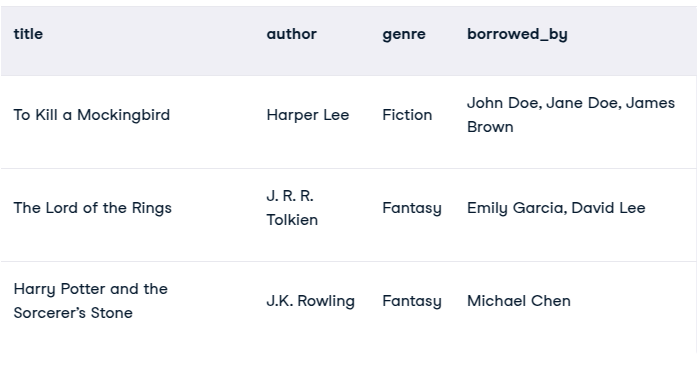
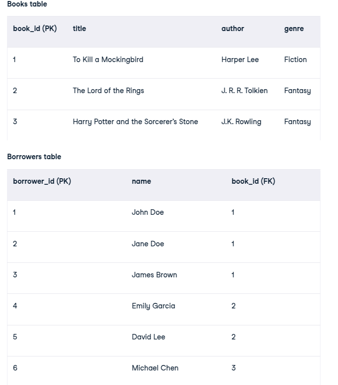
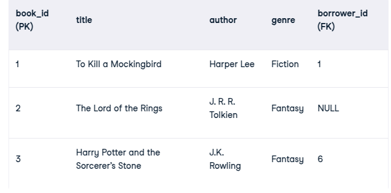
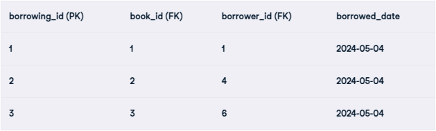
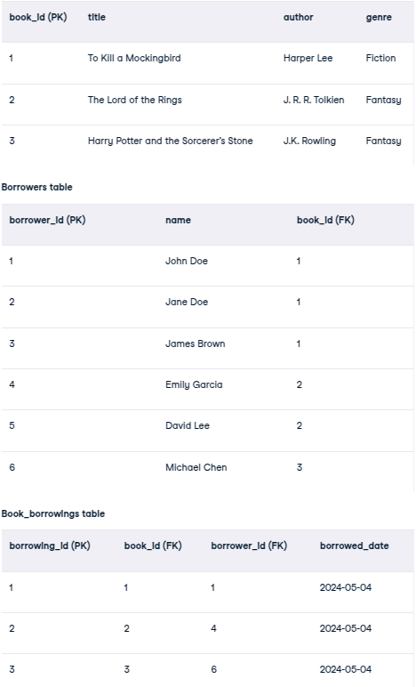
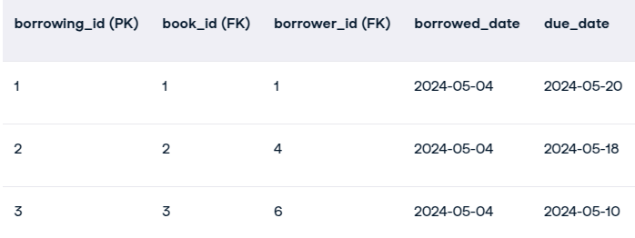

# SQL

## What is SQL?

SQL is a standard query language used to access and manipulate data in databases. SQL stands for Structured Query Language. We can create, update, delete, and retrieve data in databases like MySQL, Oracle, PostgreSQL, etc. Overall, SQL is a query language that communicates with databases.

## What is a query in SQL?

A query in SQL (Structured Query Language) is a request made to a database to retrieve or manipulate data. It consists of a set of instructions to perform tasks such as fetching, updating, deleting, or inserting data into the database.

## Constraints in SQL

Constraints act as rules or conditions imposed on the data, dictating what values are permissible and what actions can be taken. They play a crucial role in maintaining the quality and coherence of the database by preventing errors. So, explore this section to get a hand on SQL Data Constraints.

- NOT NULL Constraints
- Primary Key Constraints
- Foreign Key Constraints
- Composite Key
- Unique Constraints
- Alternate Key
- CHECK Constraints
- DEFAULT Constraints

### Example of Constraints

```sql
CREATE TABLE table_Name
(
column1 data_type(size) NOT NULL,
column2 data_type(size) NOT NULL,
);

```

PRIMARY KEY in SQL is a column (or group of columns) that uniquely identifies the records in that table. A primary key must contain unique values and can not have any NULL value.

There can only be one primary key in a table, but that primary key can consist of one or more columns. When there are two or more columns in the primary key it is called a composite key.

A primary key automatically has a UNIQUE constraint defined on it, and it ensures that there are no duplicate or NULL values in that column.

```sql
CREATE TABLE table_name (
 column1 datatype constraint,
 column2 datatype constraint,
 CONSTRAINT pk_constraint_name PRIMARY KEY (column1, column2, …)
);
```

## What happens when you delete a foreign key in SQL?

When using postgresql you will encounter an error saying: 

update or delete on table "table" violates foreign key constraint "fk_constraint" on table "table2" DETAIL: Key (id)=(1) is still referenced from table "table2".

### What to do?

- Delete foreign key constraint
- Delete the row in the table that has the foreign key


## Sub query

A subquery is a query that is nested within another SQL query, such as SELECT, INSERT, UPDATE, or DELETE statements. It allows for performing operations that depend on the results of another query, effectively enabling multi-step data manipulation.

**Example1**


## JOINS

### Inner Join

The INNER JOIN keyword selects all rows from both the tables as long as the condition is satisfied. This keyword will create the result-set by combining all rows from both the tables where the condition satisfies i.e value of the common field will be the same. 

```sql
SELECT table1.column1,table1.column2,table2.column1,....
FROM table1 
INNER JOIN table2
ON  table1.matching_column = table2.matching_column;
```

### Left Join 

LEFT JOIN returns all the rows of the table on the left side of the join and matches rows for the table on the right side of the join. For the rows for which there is no matching row on the right side, the result-set will contain null. LEFT JOIN is also known as LEFT OUTER JOIN.

```sql
SELECT Student.NAME,StudentCourse.COURSE_ID 
FROM Student
LEFT JOIN StudentCourse 
ON StudentCourse.ROLL_NO = Student.ROLL_NO;
```


### Right Join

Same as Left but for right table.

### Full Join

FULL JOIN creates the result-set by combining results of both LEFT JOIN and RIGHT JOIN. The result-set will contain all the rows from both tables. For the rows for which there is no matching, the result-set will contain NULL values.

So it's like combining both left and right join.

## Aggregate Functions

Aggregate functions are used to perform operations on a set of values to return a single value. It is often used with the GROUP BY clause of the SELECT statement.

- AVG() – Returns the average of a set.
- COUNT() – Returns the number of rows in a set.
- FIRST() – Returns the first value in a set.
- LAST() – Returns the last value in a set.
- MAX() – Returns the maximum value in a set.
- MIN() – Returns the minimum value in a set.
- SUM() – Returns the sum of all or distinct values in a set.

```sql
SELECT AVG(column_name) FROM table_name;
SELECT COUNT(column_name) FROM table_name;
SELECT MAX(column_name) FROM table_name;
SELECT MIN(column_name) FROM table_name;
```

## Group By

The GROUP BY statement is used in conjunction with the aggregate functions to group the result-set by one or more columns.

```sql
SELECT column_name, aggregate_function(column_name)
FROM table_name
WHERE condition
GROUP BY column_name;
```

## SQL Injection

SQL Injection (SQLi) is a security vulnerability that occurs when an attacker is able to manipulate a web application’s database queries by inserting malicious SQL code into user input fields. These injected queries can manipulate the underlying database to retrieve, modify, or delete sensitive data. In some cases, attackers can even escalate privileges, gaining full control over the database or server.

### Types of SQL Injection

1. **In-band SQLi (Classic SQLi):** In-band SQLi is the most common type of SQL injection. It occurs when an attacker is able to use the same communication channel to both launch the attack and gather results. This type of SQL injection is typically easy to exploit and can be used to retrieve data from the database.
2. **Inferential SQLi (Blind SQLi):** Inferential SQLi, also known as Blind SQLi, is a type of SQL Injection vulnerability that does not return the results of the injected SQL query in the application’s responses. This makes the exploitation process more challenging but not impossible.
3. **Out-of-band SQLi:** Out-of-band SQLi is an advanced SQL injection technique that requires the attacker to use the database server’s out-of-band channels to launch the attack. This type of SQL injection is less common than in-band SQLi and inferential SQLi but can be just as dangerous.
4. **Error-based SQLi:** Error-based SQLi is an in-band SQL injection technique that relies on error messages thrown by the database server to obtain information about the structure of the database. This information can be used to further refine the attack.
5. **Union-based SQLi:** Union-based SQLi is an in-band SQL injection technique that uses the UNION SQL operator to combine the results of two or more SELECT statements into a single result. This technique can be used to retrieve data from other database tables.

### SQL Injection Prevention

1. Use Prepared Statements and Parameterized Queries : Prepared statements and parameterized queries ensure that user inputs are treated as data rather than part of the SQL query. This approach eliminates the risk of SQL injection.
2. Employ Stored Procedures : Stored procedures are predefined SQL queries stored in the database. These procedures can help prevent SQL injection because they don’t dynamically construct SQL queries.

```sql
CREATE PROCEDURE GetUserByUsername (IN username VARCHAR(50))
BEGIN
   SELECT * FROM users WHERE username = username;
END;
```

3. Whitelist Input Validation : Ensure that user inputs are validated before being used in SQL queries. Only allow certain characters and patterns, such as alphanumeric input, for fields like usernames or email addresses.

4. Use an ORM : Object-Relational Mapping (ORM) frameworks like Hibernate or Entity Framework can help prevent SQL injection by automatically handling query generation, preventing dynamic query construction.

## Normalization

Normalization is a systematic approach to organize data in a database to eliminate redundancy, avoid anomalies and ensure data consistency. The process involves breaking down large tables into smaller, well-structured ones and defining relationships between them. This not only reduces the chances of storing duplicate data but also improves the overall efficiency of the database.


A relation in BCNF is also in 3NF , a relation in 3NF is also in 2NF and a relation in 2NF is also in 1NF.
A relation in BCNF is considered fully normalized.

### First Normal Form (1NF)

First Normal Form (1NF) ensures that each column in a table contains single, indivisible values, and each row is unique. A table violates 1NF if it has composite or multi-valued attributes, such as multiple phone numbers in one cell. 1NF simplifies data, making it consistent and easy to manage.


We will fix borrowers to be in another table.


### Second Normal Form (2NF)

Eliminates partial dependencies by ensuring that non-key attributes depend only on the primary key. What this means, in essence, is that there should be a direct relationship between each column and the primary key, and not between other columns.



This might look like a solution, but it violates 2NF simply because the borrower_id only partially depends on the book_id. A book can have multiple borrowers, but a single borrower_id can only be linked to one book in this structure. This creates a partial dependency.


We need to achieve the many-to-many relationship between books and borrowers to achieve 2NF. 



### Third Normal Form (3NF)

3NF builds on 2NF by eliminating transitive dependencies. A transitive dependency occurs when a non-key attribute depends on another non-key attribute, which in turn depends on the primary key. It basically takes its meaning from the transitive law.



The 2NF structure looks efficient, but there might be a hidden dependency. Imagine we add a due_date column to the books table. This might seem logical at first sight, but it’s going to create a transitive dependency where:

- The due_date column depends on the borrowing_id (a non-key attribute) from the book_borrowings table.
- The borrowing_id in turn depends on book_id (the primary key) of the books table.

The implication of this is that due_date relies on an intermediate non-key attribute (borrowing_id) instead of directly depending on the primary key (book_id). This violates 3NF.

The solution is to move the due_date column to the most appropriate table by updating the book_borrowings table to include the due_date and returned_date columns.



By placing the due_date column in the book_borrowing table, we have successfully eliminated the transitive dependency.

### Boyce-Codd Normal Form (BCNF)

BCNF is based on functional dependencies that consider all candidate keys in a relationship.

Functional dependencies (FD) define relationships between attributes within a relational database. An FD states that the value of one column determines the value of another related column. FDs are very important because they guide the process of normalization by identifying dependencies and ensuring data is appropriately distributed across tables.

## DDL


DDL (Data Definition Language) is a family of SQL language elements used to define database structure (including operations with databases, tables, columns, indexes, views, stored procedures, constraints).