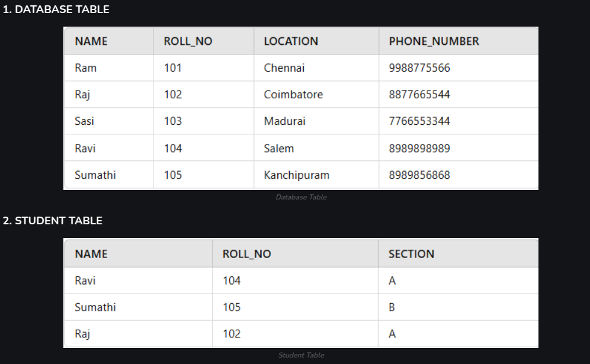
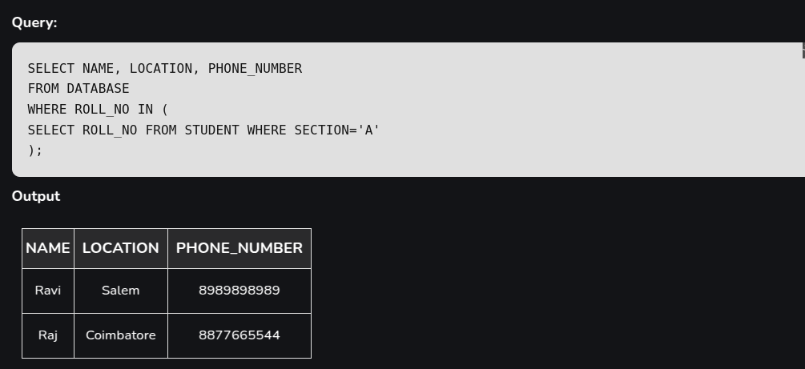

# SQL

## What is SQL?

SQL is a standard query language used to access and manipulate data in databases. SQL stands for Structured Query Language. We can create, update, delete, and retrieve data in databases like MySQL, Oracle, PostgreSQL, etc. Overall, SQL is a query language that communicates with databases.

## What is a query in SQL?

A query in SQL (Structured Query Language) is a request made to a database to retrieve or manipulate data. It consists of a set of instructions to perform tasks such as fetching, updating, deleting, or inserting data into the database.

## Constraints in SQL

Constraints act as rules or conditions imposed on the data, dictating what values are permissible and what actions can be taken. They play a crucial role in maintaining the quality and coherence of the database by preventing errors. So, explore this section to get a hand on SQL Data Constraints.

- NOT NULL Constraints
- Primary Key Constraints
- Foreign Key Constraints
- Composite Key
- Unique Constraints
- Alternate Key
- CHECK Constraints
- DEFAULT Constraints

### Example of Constraints

```sql
CREATE TABLE table_Name
(
column1 data_type(size) NOT NULL,
column2 data_type(size) NOT NULL,
);

```

PRIMARY KEY in SQL is a column (or group of columns) that uniquely identifies the records in that table. A primary key must contain unique values and can not have any NULL value.

There can only be one primary key in a table, but that primary key can consist of one or more columns. When there are two or more columns in the primary key it is called a composite key.

A primary key automatically has a UNIQUE constraint defined on it, and it ensures that there are no duplicate or NULL values in that column.

```sql
CREATE TABLE table_name (
 column1 datatype constraint,
 column2 datatype constraint,
 CONSTRAINT pk_constraint_name PRIMARY KEY (column1, column2, …)
);
```

## What happens when you delete a foreign key in SQL?

When using postgresql you will encounter an error saying: 

update or delete on table "table" violates foreign key constraint "fk_constraint" on table "table2" DETAIL: Key (id)=(1) is still referenced from table "table2".

### What to do?

- Delete foreign key constraint
- Delete the row in the table that has the foreign key


## Sub query

A subquery is a query that is nested within another SQL query, such as SELECT, INSERT, UPDATE, or DELETE statements. It allows for performing operations that depend on the results of another query, effectively enabling multi-step data manipulation.

**Example1**





## JOINS

### Inner Join

The INNER JOIN keyword selects all rows from both the tables as long as the condition is satisfied. This keyword will create the result-set by combining all rows from both the tables where the condition satisfies i.e value of the common field will be the same. 

```sql
SELECT table1.column1,table1.column2,table2.column1,....
FROM table1 
INNER JOIN table2
ON  table1.matching_column = table2.matching_column;
```

### Left Join 

LEFT JOIN returns all the rows of the table on the left side of the join and matches rows for the table on the right side of the join. For the rows for which there is no matching row on the right side, the result-set will contain null. LEFT JOIN is also known as LEFT OUTER JOIN.

