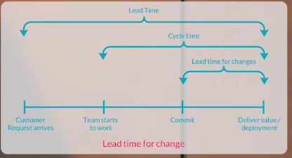
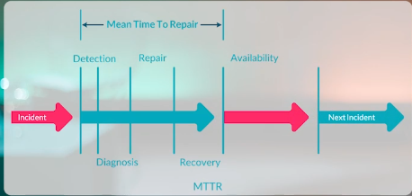
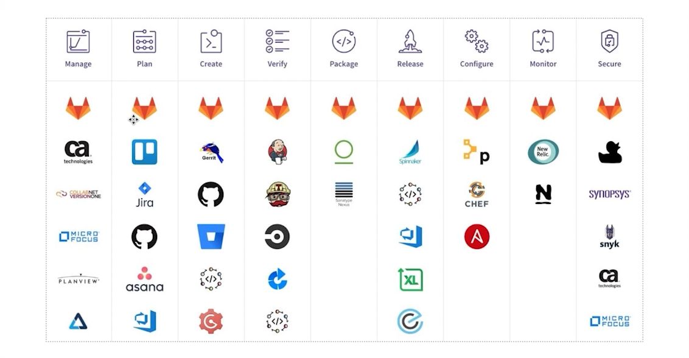

# DevOps Goal

Better performance and uptime of applications and services,
faster time to market, and improved collaboration between development and operations teams.

# About DevOps

حلقه اینفینیتی

## DevOps has 7 main parts

- Continuous Development
- Continuous Integration
- Continuous Testing
- Continuous Deployment/Continuous Delivery
- Continuous Monitoring
- Continuous Feedback
- Continuous Operations

## DevOps Metrics

Calculate how much DevOps is implemented in the company.

### Important Metrics

- *Lead Time for Changes*: The time it takes to go from code commit to code running in production.

- *Change Failure Rate*: The percentage of changes that fail in production.

- *Change Frequency/Deployment Frequency*: The number of changes that are deployed to production in a given time period.

- *Mean Time to Recovery (MTTR)*: The average time it takes to recover from a failure in production.

- *Customer Ticket*: The number of customer-reported issues in a given time period.

## Tools

### Priodic Table of DevOps Tools

[Specs](https://digital.ai/learn/devsecops-periodic-table/)

[Landscape of techs](https://landscape.cncf.io/)