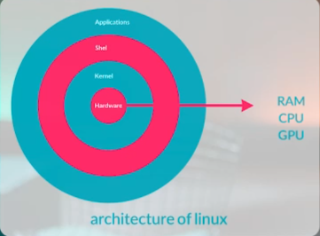
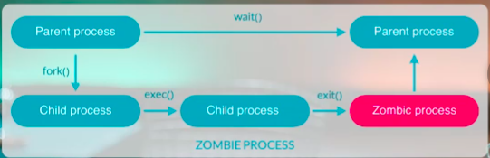
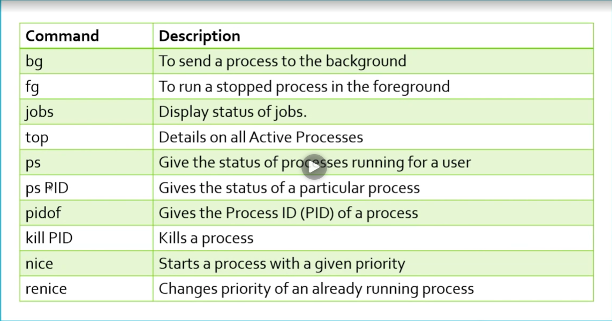

# Process Management

everything is possible with the shell so you dont have to use desktop

### What is process
it's an instance of the application. it has 2 types : 
- **Foreground**: the process that is running in the terminal
- **Background**: the process that is running in the background and you can use the terminal for other tasks.

### What is Daemon

A process that runs in the background and is not attached to any terminal. It is usually started at boot time and runs continuously until the system is shut down. Daemons are used to perform tasks such as logging, scheduling, and monitoring.

### What is PID
PID is the Process IDentifier. It is a unique number assigned to each process running on the system. The PID is used by the operating system to manage processes and allocate resources. The PID is assigned when the process is created and remains the same until the process is terminated.

### Task states
- Ready
- Waiting
- Running
- Terminated
- Zombie (Orphan)

### Some important commands for process management

- `bg` : To send a process to the background
- `fg` : To run a stopped or suspended process in the foreground
- `top` : To display the list of processes running on the system
- `ps` : Gives the status of the processes running on the system
- `pstree` : Displays the processes in a tree format
- `kill` : To kill a process
- `killall` : To kill all processes with the same name
- `pkill` : To kill a process by its name
- `nice` : To change the priority of a process
- `renice` : To change the priority of a running process
- `nohup` : To run a process in the background and ignore the hangup signal
- `disown` : To remove a process from the shell's job table
- `jobs` : To display the list of jobs running in the background
- `wait` : To wait for a process to finish
- `strace` : To trace system calls and signals
- `pidof` : To get the PID of a process by its name
- `df` : To display the hard disk space usage
- `free` : To display the memory usage