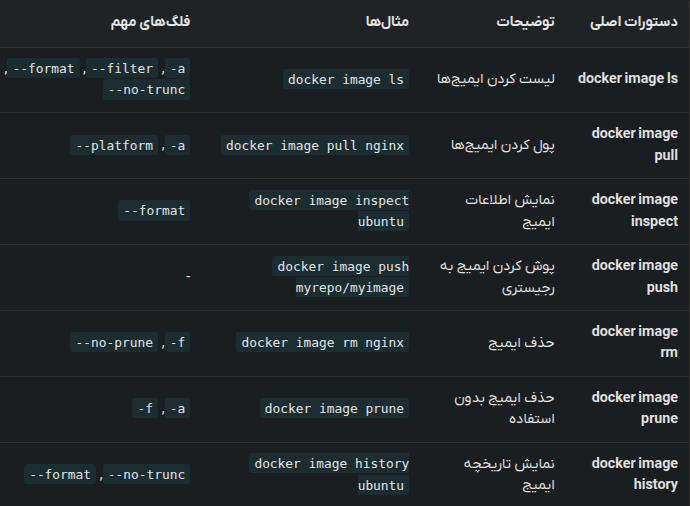
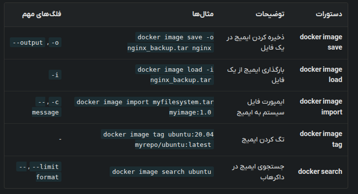

# Commands

### Listing All the downloaded images
```shell
docker image ls
```

for showing all including dangling images use `-a`

For specifying repository
```shell
docker images alpine
```

### Pulling images

```shell
docker image pull IMAGE_NAME[:TAG]
```

For specifying the cpu architecture

```shell
docker image pull --platform linux/amd64 alpine:3.21.3
```

### Inspecting images

```shell
docker image inspect redis
```


### Pushing image to docker registry


Firstly, your bitch ass needs to login
```shell
docker login
```

specify a tag for the image
```shell
docker image tag SOURCE_IMAGE TARGET_IMAGE
```

```shell
docker image push myrepo/myimage:1.0
```

### Deleting image

```shell
docker image rm IMAGE_NAME
```

if u try removing an image with a running container it will throw an error so use `-f`

To remove unnecessary images that are not used use:
```shell
docker image prune
```



### Saving images in tar

```shell
docker image save -o nginx_backup.tar nginx
docker image save -o images_backup.tar ubuntu nginx redis
```

### Load images

```shell
docker image load -i FILE_NAME.tar
```

### Importing images

Creates an image from a tar file or an URL. Unlike in `docker image load` the importing package doesn't need to be an image.

```shell
docker image import myfilesystem.tar myimage:1.0
docker image import -c "CMD ['bash']" myfilesystem.tar myimage:latest
docker image import http://example.com/filesystem.tar myimage:latest
```

### Searching 

Searches for images in docker registry

```shell
docker search php
docker search --filter=stars=3 php
docker search --limit=1 php
docker search --filter is-official=true mongo
```

