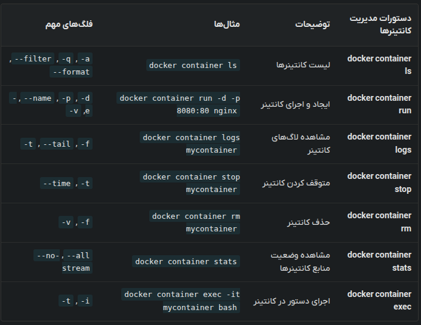
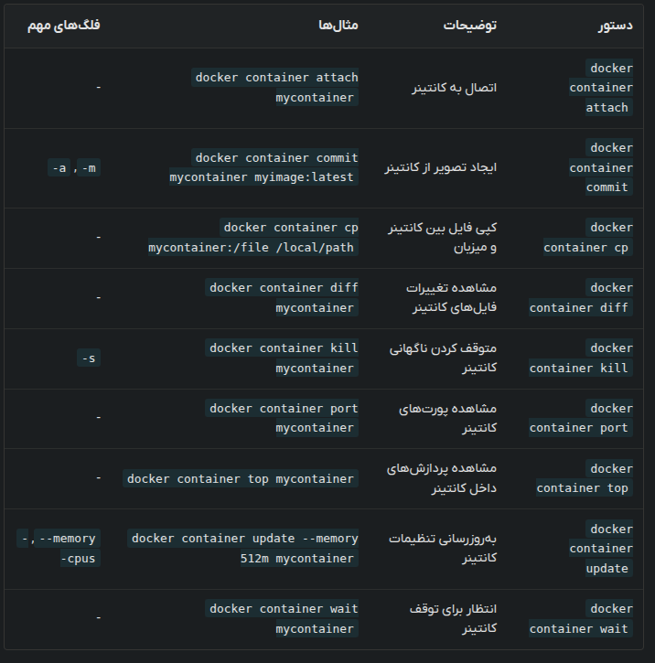

# Working with images

### Listing All the downloaded images
```shell
docker image ls
```

for showing all including dangling images use `-a`

For specifying repository
```shell
docker images alpine
```

### Pulling images

```shell
docker image pull IMAGE_NAME[:TAG]
```

For specifying the cpu architecture

```shell
docker image pull --platform linux/amd64 alpine:3.21.3
```

### Inspecting images

```shell
docker image inspect redis
```


### Pushing image to docker registry


Firstly, your bitch ass needs to login
```shell
docker login
```

specify a tag for the image
```shell
docker image tag SOURCE_IMAGE TARGET_IMAGE
```

```shell
docker image push myrepo/myimage:1.0
```

### Deleting image

```shell
docker image rm IMAGE_NAME
```

if u try removing an image with a running container it will throw an error so use `-f`

To remove unnecessary images that are not used use:
```shell
docker image prune
```


### Saving images in tar

```shell
docker image save -o nginx_backup.tar nginx
docker image save -o images_backup.tar ubuntu nginx redis
```

### Tagging images

Setting tag or specifying version before pushing to registry

```shell
docker image tag SOURCE_IMAGE[:TAG] TARGET_IMAGE[:TAG]
docker image tag ubuntu:20.04 myrepo/ubuntu:latest
docker image tag nginx myrepo/nginx:v2.0
```

### Load images

```shell
docker image load -i FILE_NAME.tar
```

### Importing images

Creates an image from a tar file or an URL. Unlike in `docker image load` the importing package doesn't need to be an image.

```shell
docker image import myfilesystem.tar myimage:1.0
docker image import -c "CMD ['bash']" myfilesystem.tar myimage:latest
docker image import http://example.com/filesystem.tar myimage:latest
```

### Searching 

Searches for images in docker registry

```shell
docker search php
docker search --filter=stars=3 php
docker search --limit=1 php
docker search --filter is-official=true mongo
```


# Working with Containers

These are same

```shell
docker container ls
docker ps
```

### Running containers
This creates and run a new container 

```shell
docker container run nginx
docker container run -d -p 8080:80 nginx
docker container run -d --name mynginx -e ENV_VAR=production nginx
```

- `--name` for specifying container's name
- `-d` for running in background
- `-e` for setting env variables
- `-v` for setting volume
- `-p` for mapping ports
- `--rm` will remove the running instance of the container and it's resources

### Logging containers

```shell
docker container logs mycontainer
docker container logs -f mycontainer
docker container logs --tail 10 mycontainer
```

- `-f` for live logging
- `--tail` only shows certain amount of last lines
- `-t` adds timestamps to logs

### Stopping

Dockers sends SIGTERM to all processes in the container before stopping it. By using `-t` we can specify time before sending SIGKILL

```shell
docker container stop mycontainer
docker container stop container1 container2
```

### Removing 

```shell
docker container rm mycontainer
docker container rm container1 container2
docker container rm -f mycontainer
```

- `-f` for forcing running
- `-v` also removes the volumes connected to the container

### Stats

```shell
docker container stats
docker container stats mycontainer
docker container stats --no-stream
```

### Exec 

```shell
docker container exec
```

- `-i` for interactive
- `-t` for specifying TTY

```shell
docker container exec -it mycontainer bash
docker container exec mycontainer ls /app
```



### Attach

Connects the I/O of 2 containers. To exit without stop use `CTRL + Q` and `CTRL + P`

### Commiting container

Creates an image from the current state of the container

- `-m` for message
- `-` for author

```shell
docker container commit mycontainer myimage:latest
```

### Copying file 

```shell
docker container cp mycontainer:/path/to/file /local/path
docker container cp /local/path mycontainer:/path/to/file
```

### Diff

Shows list of deleted and changed and added files in container

```shell
docker container diff mycontainer
```

### Kill

Sends SIGKILL by default and can change the killing signal with `-s`.

```shell
docker container kill -s SIGTERM mycontainer
```

### Port

Shows the ports

```shell
docker container port mycontainer
```

### Top

It's like `ps` in linux

```shell
docker container top mycontainer
```

### Update

Can update the resources allocated to a container

```shell
docker container update --memory 512m --cpus 1 mycontainer
```

### Wait

This waits until a container stops and prints the output.

```shell
docker container wait mycontainer
```

