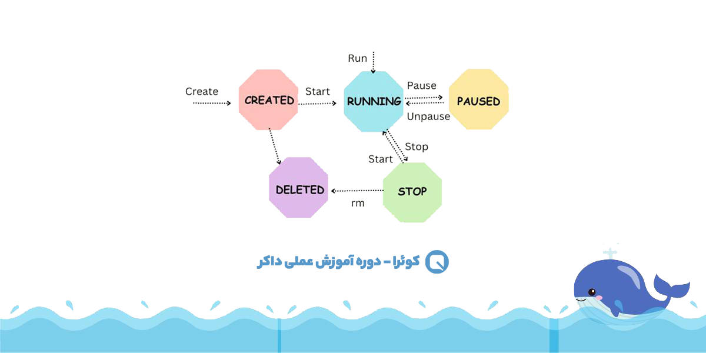
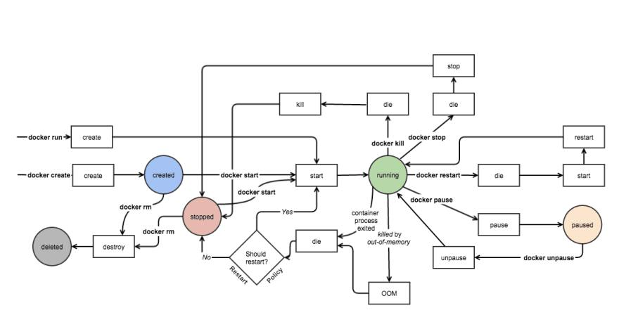

# Lifecycle

## States

- `Created`: When we create a container but not yet run it. There is no process in the container.
- `Running`: When running and has processes and being able to see logs, run commands and ... . From this state we can pause and stop the container. Pausing is for small time.
- `Paused`: Freezes all processes in the container and stays in the storage. We can use `unpause` command to run it again.
- `Stopped`: If we turn the container off with `kill` or `stop` command
- `Deleted`: Completely removed from system with `rm` command.