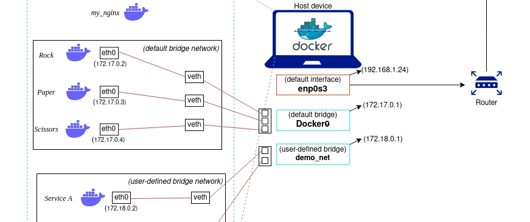

# Docker Networking

Each container has its own network and each network has a driver.

Drivers have various functionalities for example some assign ip and some doesn't.

Run the `ip route` command to see network interfaces. There is an interface called docker0 and is used for docker only.

## Commands

### ls

listing networks

```shell
docker network ls
```

### create

creating a network 

```shell
docker network create -d bridge kshyst-network
```

### inspect

For inspecting a network

```shell
docker network inspect kshyst-network
```

### connect

```shell
docker network connect kshyst-network <container-name>
```

### prune

deleting not used networks

### rm

deleting

## Network Drivers

### Bridge

It is like a wire which connect 2 networks directly and is the default network for docker containers.



Interfaces are defined on host.

In bridge, each container gets a unique ip address, you can get this ip address by using `docker inspect [CONTAINER-ID]`.

Because of this unique ip address mapping, for connecting to a network in this case we should use the NAT on the host that could cause performance issues

### Host

In this case containers don't get unique ip and will use the hosts ip and ports. so we don't use the NAT on host device.

This type of driver could cause security issues due to lack of isolation between network in container and host.

### Overlay

For networking between containers on different hosts. Usually used in kubernetes and docker-swarm. Overlay is important in load balancing and microservices.

### Macvlan

Gives each container on its network a unique MAC address which makes each container appear as separate physical device.

Containers on Macvlan can get their IP addresses from network that host is using.

### IPvlan

Like Macvlan but each container is sub network of the host's network and get their ip address from host

There are 2 types for this:

- **L2**: Just like Macvlan 
- **L3**: Traffic between containers and host will be directed though hosts ip address

### None

No network. Only has loopback