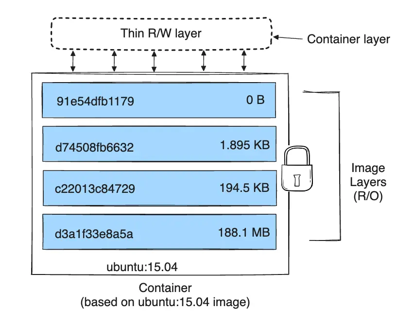

# Docker Volume

In docker we usually need the data of a container even after it stopped



Without defining volume for a container it is stateless

For example running redis with saving data:

```shell
docker run --rm --name redis -d redis --appendonly yes
```

This only tells redis to save data but not the docker container

For that we need docker volume

```shell
docker run --rm --name redis -v redis_data:/data -d redis --appendonly yes
```

set data, then run again. even with different container name shows saved data.

The `--appendonly yes` will save the redis data in `appendonlydir` and for this dir to not get deleted we need to create a docker volume so the data wouldn't get lost.

By default, read and write is open to the container. We can restrict it by using `wo` and `ro`

```shell
docker run --rm --name redis -v redis_data:/data:ro -d redis --appendonly yes
```

### Anonymous volume

We don't give it a name and kaboom! it's anonymous. like this:

```shell
docker run --rm --name redis -v /data -d redis --appendonly yes
```

### `--mount`

Using this we can specify type, target and source

- type: volume or bind
- source: source dir on the host machine
- destination, dst, target: dir inside container

```shell
docker run --mount type=volume,target=/app/data,source=my-volume redis
```

### Multiple storage

use multiple -v or --mount

## Commands

### ls

Lists all volumes

It only lists docker volumes. If we map the data to a specific directory on our system, it will not show up here.

```shell
docker volume ls
```

### create

```shell
docker volume create \
  --driver local \
  --label environment=production \
  --label app=webapp \
  --opt type=tmpfs \
  --opt device=tmpfs \
  --opt o=size=100m \
  my_volume
```

ls would be:

```shell
docker volume inspect my_volume                                                                                                          ─╯
[
    {
        "CreatedAt": "2025-10-04T19:13:33+03:30",
        "Driver": "local",
        "Labels": {
            "app": "webapp",
            "environment": "production"
        },
        "Mountpoint": "/var/lib/docker/volumes/my_volume/_data",
        "Name": "my_volume",
        "Options": {
            "device": "tmpfs",
            "o": "size=100m",
            "type": "tmpfs"
        },
        "Scope": "local"
    }
]
```

### prune and rm

same same

## Bind Mounting

Literally mounting on a folder in hosts machine. Every read and write is visible to both sides.

Difference is, docker volumes are only accessible through docker engine but bind mounted storage nein.

## TMPFS

Temporarily File System.

```shell
docker run -d \
  --name myapp \
  --tmpfs /app/cache:size=100m,mode=1777 \
  nginx:alpine
```

The mode 1777 means everyone can write but only owner can delete

You can also use `--mount` to use tmpfs

```shell
docker run -d \
  --name myapp2 \
  --mount type=tmpfs,destination=/app/cache,tmpfs-size=100m \
  nginx:alpine
```