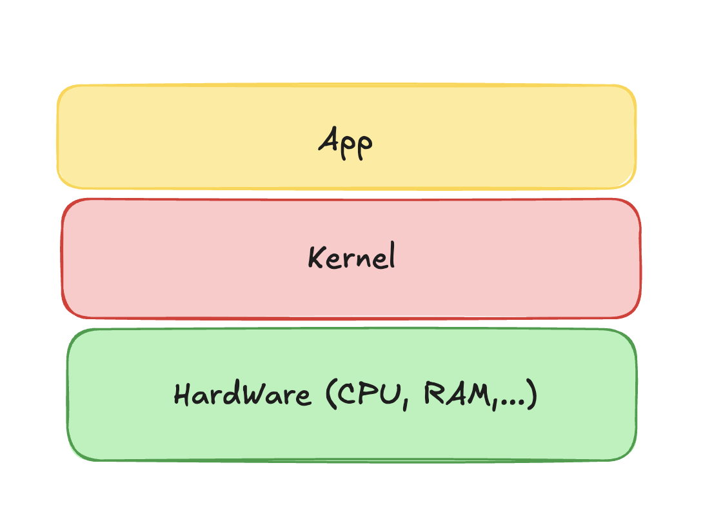

# Hypervisors

If we wish to run multiple operating systems on a single machine we need to distribute resources across these systems

## What is hypervisor

A software or sometimes a hardware that distributes resource and acts like receptionist in hotel:

VMs only share the same hardware.

- hotel : server
- rooms : hardwares
- guests : operating systems

## Bare Metal

Runs directly on the hardware and there is no middle software.

VMware ESXi, Microsoft Hyper-V, Xen

## Hosted

Runs on top of the OS

VirtualBox, VMware Workstation, Parallels Desktop

## Hypervisor Usages

- Azure and AWS use hyper visors to create VPS
- Test on different operating systems

## Docker

Docker is not a hypervisor. It containerizes. It uses operating systems kernel and make isolated places for apps to run on and this is being done by **Docker Engine**.

So...

We cannot run a windows container on a linux machine but because of WSL we can run a linux machine on windows

