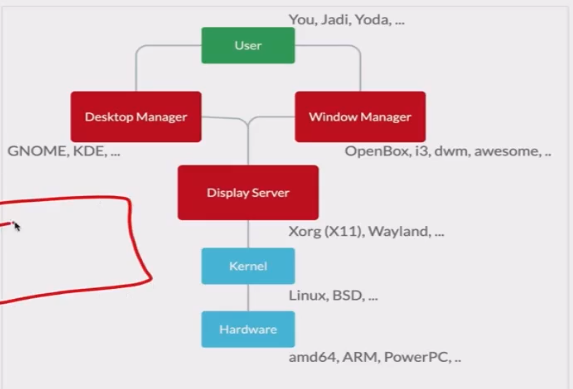

# Graphics



## 1. Display Server (The Foundation)
   The display server is the lowest level of the graphical stack. It is the piece of software that communicates directly with your operating system’s kernel and your hardware (graphics card, monitor, mouse, and keyboard).

What it does: It creates a canvas. It tells the screen which pixels to light up and listens for input (like a mouse click or a keystroke). However, it does not know how to organize windows or make them look pretty.
Examples:
- X11 (X.org): The traditional display server used in Linux for decades.
- Wayland: The modern, more secure replacement for X11 (though technically, Wayland is a protocol, and the implementation is handled by a “compositor”).

## 2. Window Manager (The Frame)
   If the display server creates raw, borderless boxes on a canvas, the Window Manager (WM) is the software that gives those boxes structure.

What it does: It runs on top of the display server. It draws the window borders, title bars, and close/minimize buttons. It dictates how windows behave—allowing you to drag them around, resize them, overlap them, or snap them side-by-side.
Types:
- Stacking/Floating: Windows act like pieces of paper on a desk, overlapping each other (like traditional Windows or macOS).
- Tiling: Windows automatically arrange themselves in a grid so they never overlap, maximizing screen space (popular with power users).
- Examples: KWin, Mutter, Openbox, i3, Sway, Awesome.

## 3. Desktop Environment (The Interior Design)
   (Note: People sometimes use “Desktop Manager,” but the correct term is usually Desktop Environment).

A Desktop Environment (DE) is the complete, cohesive package that the average user interacts with. It sits on top of—and includes—a Window Manager.

What it does: It provides a unified look and feel. A DE gives you a taskbar, a system tray (clock, volume, Wi-Fi), a start menu, desktop icons, wallpapers, and a suite of default applications (like a file manager, text editor, and settings app) that all share the same visual theme.
Examples:
- GNOME: (Uses the Mutter Window Manager).
- KDE Plasma: (Uses the KWin Window Manager).
- XFCE: (Uses the Xfwm Window Manager).

---

# X

The X window system is a network transparent window system which runs on wide range of 
computing and graphic machines.

Started with XFree86 but then X.org started its own X server which is called X11 today.

> When saying X we are referring to whole family of network protocols describing how messages are exchanged between a client and a display server. X11 is 11th version.

Confs are under : `/etc/X11/xorg.conf`

In new systems you can't see this config file easily. If you need to configure, run this command to make config file.

```shell
Xorg -configure
```

## xhost

This command controls the access to the X server. If you are on X server and you run
`xhost` it tells you your access status.

```shell
xhost
#/usr/lib/xorg/Xorg.wrap: Only console users are allowed to run the X server
xhost + #To open access to unauthorized users
xhost - 

xhost 192.1.2.3 # Adds this host to authorized hosts
```

### X Forwarding

Set  `X11Forwarding` to `yes` in `/etc/ssh/sshd_config`

```shell
ssh -X server.ir
```

Then if you run for example `xeyes` on your server it will appear on your machine.

Other remote desktop apps: `VNC`, `RDP`, `Spice`