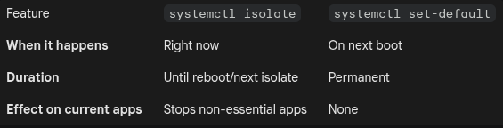

# Run Levels

For SystemV. Defines what tasks can be accomplished in the current state of a Linux system.

## systemd

Has different targets which are groups of services.

```shell
systemctl list-units --type=target
```

Getting the default one

```shell
systemctl get-default 
```

### targets
defines a specific state the system should be in by synchronizing various services and units.

Debian primarily uses systemd targets to manage boot states, with graphical.target (GUI) as the default for desktop installations and multi-user.target (CLI) for servers. Use `systemctl get-default` to view the current setting and `systemctl set-default <target>`.target to change it.

Getting status:

```shell
systemctl status multi-user.target 
```

Isolating targets:

When you use the isolate command, systemd doesn't just start the new target; it immediately stops every service that isn't required by that new target.

Famous targets:

- `rescue`: Local file systems are mounted, no networking, and root-user only (maintenance mode)
- `emergency`: Only the root file system and in read-only mode, No networking and root-user only(maintenance mode)
- `reboot`
- `halt`: Stops all processes and halt CPU activities
- `poweroff`: Like halt but also sends an ACPI shutdown signal (No lights!)

```shell
systemctl is-system-running
systemctl isolate emergency
systemctl is-system-running
```

Think of isolate as a "reset" for your current session.

- **Dependency Check**: systemd looks at the target you want to reach.

- **Start Phase**: It starts all services required by that target.

- **Stop Phase**: It kills everything else currently running that isn't a dependency of the new target.

Entering Terminal 

```shell
sudo systemctl isolate multi-user.target
```

Entering GUI

```shell
sudo systemctl isolate graphical.target
```



## SysV runlevels

On SysV we were able to define different stages. On a Red Hat-based system we usually had 7:


RedHat:
0. Shutdown
1. Single-user mode (recovery); Also called S or s
2. Multi-user without networking
3. Multi-user with networking
4. to be customized by the admin
5. Multi-user with networking and graphics
6. Reboot

Debian:
0. Shutdown
1. Single-user mode
2. Multi-user mode with graphics
6. Reboot

### Checking status and setting defaults

Check current runlevel(also works on systemd machines)
default is in `/etc/inittab`

```shell
runlevel
```

### init command

The pid=1 in SystemV era and is replaced with systemctl commands. These commands in new system works but only to map it to the systemctl commands.


- `init 0`: Shuts down the system (maps to systemctl poweroff).

- `init 1` or init s: Switches to single-user rescue mode.

- `init 3`: Switches to multi-user networking mode (no GUI).

- `init 5`: Switches to graphical mode.

- `init 6`: Reboots the machine (maps to systemctl reboot).

- `init q`: In the old days, this reloaded the /etc/inittab file. Since systemd doesn't use that file, this command essentially tells systemd to reload its daemon configuration (systemctl daemon-reload).

You can find the files in /etc/init.d and runlevels in /etc/rc[0-6].d directories where S indicates Start and K indicates Kill.

On systemd, you can find the configs in:

- `/etc/systemd`
- `/usr/lib/systemd/`

### /etc/inittab

Deprecated

```shell
# inittab       This file describes how the INIT process should be set up
#               the system in a certain run-level.
#
# Author:       Miquel van Smoorenburg, <miquels@drinkel.nl.mugnet.org>
#               Modified for RHS Linux by Marc Ewing and Donnie Barnes
#

# Default runlevel. The runlevels used by RHS are:
#   0 - halt (Do NOT set initdefault to this)
#   1 - Single-user mode
#   2 - Multiuser, without NFS (The same as 3, if you do not have networking)
#   3 - Full multiuser mode
#   4 - unused
#   5 - X11
#   6 - reboot (Do NOT set initdefault to this)
#
id:5:initdefault:

# System initialization.
si::sysinit:/etc/rc.d/rc.sysinit

l0:0:wait:/etc/rc.d/rc 0
l1:1:wait:/etc/rc.d/rc 1
l2:2:wait:/etc/rc.d/rc 2
l3:3:wait:/etc/rc.d/rc 3
l4:4:wait:/etc/rc.d/rc 4
l5:5:wait:/etc/rc.d/rc 5
l6:6:wait:/etc/rc.d/rc 6

# Trap CTRL-ALT-DELETE
ca::ctrlaltdel:/sbin/shutdown -t3 -r now

# When our UPS tells us power has failed, assume we have a few minutes
# of power left.  Schedule a shutdown for 2 minutes from now.
# This does, of course, assume you have powered installed and your
# UPS connected and working correctly.
pf::powerfail:/sbin/shutdown -f -h +2 "Power Failure; System Shutting Down"

# If power was restored before the shutdown kicked in, cancel it.
pr:12345:powerokwait:/sbin/shutdown -c "Power Restored; Shutdown Cancelled"


# Run gettys in standard runlevels
1:2345:respawn:/sbin/mingetty tty1
2:2345:respawn:/sbin/mingetty tty2
3:2345:respawn:/sbin/mingetty tty3
4:2345:respawn:/sbin/mingetty tty4
5:2345:respawn:/sbin/mingetty tty5
6:2345:respawn:/sbin/mingetty tty6

# Run xdm in runlevel 5
x:5:respawn:/etc/X11/prefdm -nodaemon
```

Format:

```shell
id:runlevels:action:process
```

All scripts:

```shell
ls -ltrh /etc/init.d
```

Stop and Start runlevels:

```shell
ls /etc/rc2.d/
```

## Stopping the System

The preferred method to shut down or reboot the system is to use the `shutdown` command, which first sends a warning message to all logged-in users and blocks any further non-root logins. It then signals init to switch runlevels. The init process then sends all running processes a SIGTERM signal, giving them a chance to save data or otherwise properly terminate. After 1 minute or another delay, if specified, init sends a SIGKILL signal to forcibly end each remaining process.

- Default is a 1-minute delay and then going to runlevel 1
- `-h` will halt the system
- `-r` will reboot the system
- Time is `hh:mm` or n (minutes) or now
- Whatever you add, will be broadcasted to logged-in users using the wall command
- If the command is running, `ctrl+c` or the `shutdown -c` will cancel it
- `-t60` will delay 60 seconds between SIGTERM and SIGKILL
- if you cancel a shutdown, users will get the news

Others:

- The `halt` command halts the system.
- The `poweroff` command halts the system and then attempts to power it off.
- The `reboot` command halts the system and then reboots it.

## Advanced Configuration and Power Interface (ACPI)

ACPI provides an open standard that operating systems can use to discover and configure computer hardware components, perform power management (e.g. putting unused hardware components to sleep), perform auto-configuration (e.g. Plug and Play, and hot-swapping), and perform status monitoring.

This subsystem lets OS commands (like shutdown) send signals to the computer which results in powering down of the whole PC. In older times we used to have these mechanical keyboards to do a real power down after the OS has done its shutdown and told us that "it is not safe to power down your computer".

## Notifying Users

- `wall`: Sending wall messages to logged-in users
- `/etc/issue`: Text to be displayed on the tty terminal logins (before login)
- `/etc/issue.net`: Text to be displayed on the remote terminal logins (before login)
- `/etc/motd`: Message of the day (after login). Some companies add "Do not enter if you are not allowed" texts here for legal reasons.
- `mesg`: Command controls if you want to get wall messages or not. You can do `mesg n` and `who -T` will show mesg status. Note that shutdown wall messages do not respect the mesg status

> systemctl sends wall messages for emergency, halt, power-off, reboot, and rescue