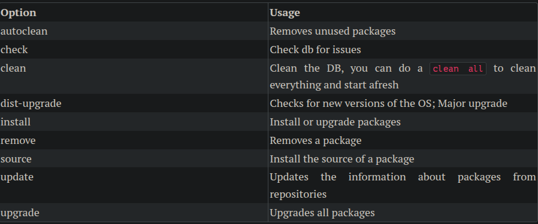
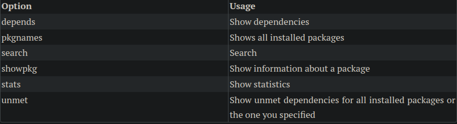

# Debian Package Management

Terms and Utilities

- `/etc/apt/sources.list`
- `/etc/apt/sources.list.d/`
- `/etc/apt/apt.conf`
- dpkg
- dpkg-reconfigure
- apt-get
- apt-cache

## Concept of the package management system

Some people think that on GNU/Linux we have to compile all the software we need manually. This is not the case in 99% of cases and never has been the case in the last 20 years. GNU/Linux is the predecessor of what we call the App Store these days. All major distros do have huge archives of pre-compiled software called their repositories and some kind of a package manager software that takes care of searching these repositories, installing software from them, finding dependencies, installing them, resolving conflicts, and updating the system and installed software. Debian-based distros use .deb files as their "packages" and use tools like apt-get, dpkg, apt, and other tools to manage them.

Debian packages are names like `NAME-VERSION-RELEASE_ARCHITECTURE.deb`; Say `tmux_3.2a-4build1_amd64.deb`.

## Repositories

Each distro has its repository of packages. It can be on a Disk, A network drive, a collection of DVDs, or most commonly, a network address on the Internet.

On debian systems, the main configuration locations are: 
- `/etc/apt/sources.list` 
- `/etc/apt/sources.list.d/`

This will check all the sources in the configs and update the information about the latest software available there.

This won't actually Upgrade the software. The Update will only Update the information about the packages and not the packages themselves.

```
apt-get update
```

To upgrade the packages:

```shell
apt-get upgrade
```

## Installing

A dry run simulation in apt is a command that shows you exactly what apt would do—which packages it would install, upgrade, or remove—without actually making any changes to your system:

```shell
apt-get install -s 
```

Download packages without installing:

```shell
apt-get install --download-only
```

If you want to download only one specific package, you can do:

```shell
apt-get download
```

## Removing

```shell
apt-get remove
```

And if you want to remove automatically installed dependencies:

```shell
apt-get autoremove
```

To remove unused packages:

```shell
apt-get autoremove
```

## Searching

If you are using the apt suit, the search is done via apt-cache or you can use the general apt.

```shell
apt-cache search "tiny window"
apt search grub2
```

## Upgrading 


For updating a single package:

```shell
apt-get install tzdata
```

And for upgrading whatever is installed:

```shell
apt-get upgrade
```

Going to a new distribution:

```shell
apt-get dist-upgrade
```

## Reconfiguring packages

Debian packages can have configuration actions that will take after the package is installed. This is done by debconf. For example, tzdata will ask you about the timezone settings after you installed it. If you want to reconfigure a package that is already installed, you can use the `dpkg-reconfigure`:

```shell
dpkg-reconfigure tzdata
```

## dpkg

The underlying tool to work with .deb files is the dpkg. It is your to-go tool if you want to do manual actions on a deb package. The general format is:

```shell
dpkg [OPTIONS] ACTION PACKAGE
```


> In some cases a package is installed but without proper dependencies (say using dpkg) or an installation is interrupted for any reason. In these cases a apt-get install -f might help, -f is for fix broken

## apt options



## apt-cache options


