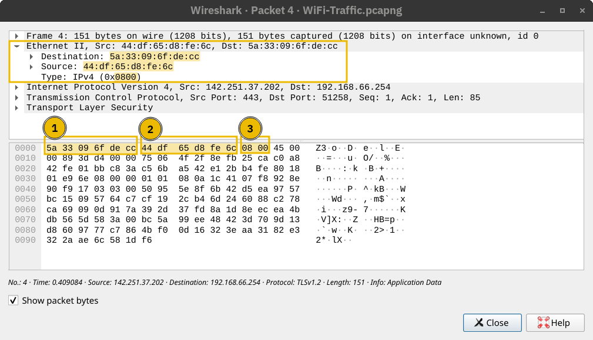

# Address Resolution Protocol(ARP)

When creating data link frames, even though you have the IP of the target machine in packet but you need to have the target's MAC address too.

## MAC Address

A 48-bit number typically represented in hexadecimal notation.

Devices on the same Ethernet network don't need to have each others MAC addresses all the time. They only need it when communicating. Everything revolves around IP Addresses.

Consider this scenario: You connect your device to a network, and if the network has a DHCP server, your device is automatically configured to use a specific gateway (router) and DNS server. Consequently, your device knows the IP address of the DNS server to resolve any domain name; moreover, it knows the IP address of the router when it needs to send packets over the Internet. In all this scenario, no MAC addresses are revealed. However, two devices on the same Ethernet cannot communicate without knowing each other’s MAC addresses.



1. Destination MAC address
2. Source MAC address
3. Type (IPv4 in this case)

Address Resolution Protocol (ARP) makes it possible to find the MAC address of another device on the Ethernet.

```shell
tshark -Nn
```

```shell
    1 0.000000000 cc:5e:f8:02:21:a7 → ff:ff:ff:ff:ff:ff ARP 42 Who has 192.168.66.1? Tell 192.168.66.89
    2 0.003566632 44:df:65:d8:fe:6c → cc:5e:f8:02:21:a7 ARP 42 192.168.66.1 is at 44:df:65:d8:fe:6c
```

Using tcp dump

```shell
tcpdump -n -v
```

```shell
17:23:44.506615 ARP, Ethernet (len 6), IPv4 (len 4), Request who-has 192.168.66.1 tell 192.168.66.89, length 28
17:23:44.510182 ARP, Ethernet (len 6), IPv4 (len 4), Reply 192.168.66.1 is-at 44:df:65:d8:fe:6c, length 28
```

An ARP Request or ARP Reply is not encapsulated within a UDP or even IP packet; it is encapsulated directly within an Ethernet frame.

