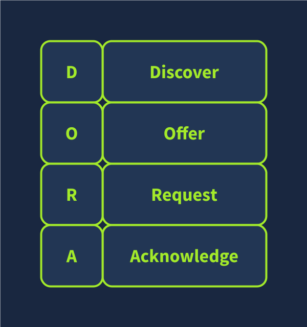

# Dynamic Host Configuration Protocol(DHCP) 

Whenever we're trying to connect to a network we need to configure these:

- IP and subnet mask
- Router (Default Gateway)
- DNS server

DHCP is an application level protocol based on UDP for configuring these.

The server listens on UDP port 67 and client sends on UDP port 68.




To use DHCP the following procedure is followed:

1. **DHCP Discover:** The client broadcasts `DHCPDISCOVER` message seeking the local DHCP server if exists.
2. **DHCP Offer:** The server responds with a `DHCPOFFER` message with an IP address available for the client to accept.
3. **DHCP Request:** The client responds with `DHCPREQUEST` to indicate that it has accepted the IP address.
4. **DHCP Acknowledge:** The server responds with `DHCPACK` to confirm that the offered IP is now assigned to this client.

Packet capture to see the process:

```shell
tshark -r DHCP-G5000.pcap -n
```

```shell
    1   0.000000      0.0.0.0 → 255.255.255.255 DHCP 342 DHCP Discover - Transaction ID 0xfb92d53f
    2   0.013904 192.168.66.1 → 192.168.66.133 DHCP 376 DHCP Offer    - Transaction ID 0xfb92d53f
    3   4.115318      0.0.0.0 → 255.255.255.255 DHCP 342 DHCP Request  - Transaction ID 0xfb92d53f
    4   4.228117 192.168.66.1 → 192.168.66.133 DHCP 376 DHCP ACK      - Transaction ID 0xfb92d53f
```

We can see that the client starts without any configurations. It only has MAC address. So it sends from `0.0.0.0` to the broadcast IP address `255.255.255.255`

As for the link layer, in the first and third packets, the client sends to the broadcast MAC address, ff:ff:ff:ff:ff:ff (not shown in the output above). The DHCP server offers an available IP address along with the network configuration in the DHCP offer. It uses the client’s destination MAC address. (It used the proposed IP address in this example system.)

In the end we expect to have these:

- IP address to access network resources
- The gateway to route our packets outside local network
- A DNS server to resolve domain names.

