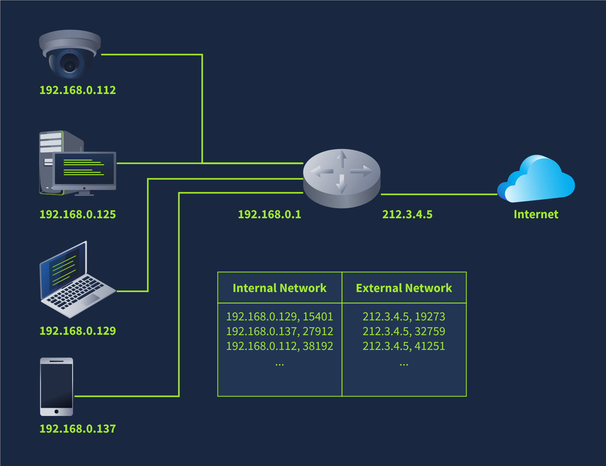

# NAT(Network Address Translation)

Using **one IP address** to provide internet access to **many private IP addresses**

Unlike normal routing, in NAT routing the router must find a way to track ongoing connection.
These routers maintain a table translating network addresses between internal and external networks.

In this diagram multiple devices connect to the internet via a single router with NAT support. 

The router maintain a table that maps the internal IP addresses and port number with its external IP address and port number. And all these are done seamlessly.