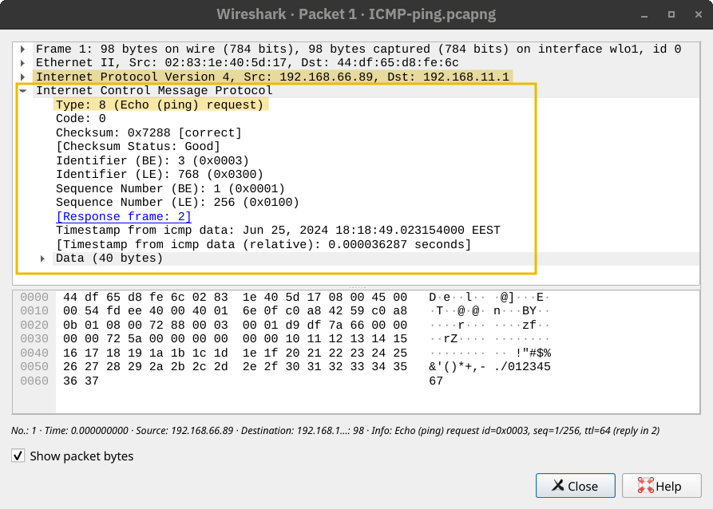
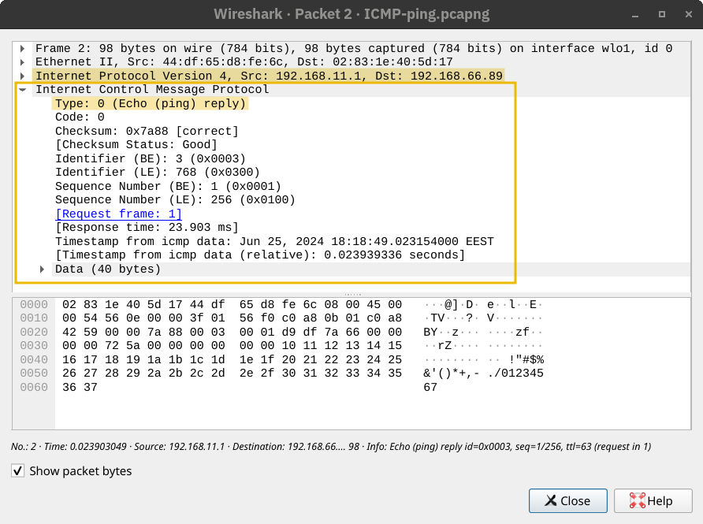

# Internet Control Message Protocol(ICMP)

Used for network diagnostics and error reporting.

Popular commands:

- `ping`: To test connectivity to a target system and measure RTT.
- `traceroute`: To discover route from host to target.

## Ping 

Ping command sends an ICMP request with type `8`



The receiver responds with Echo reply with ICPM type `0`



This command only pings 4 times.
```shell
ping 0.0.0.0 -c 4
```

## Traceroute

TTL(Time To Live) is the maximum number of routers a packet can travel before it drops. Every router decrement the TTL by one 
Before it sends it to the next router. When it reaches 0, it drops the packet and sends ICMP time exceeded message which is ICMP type `11`.

