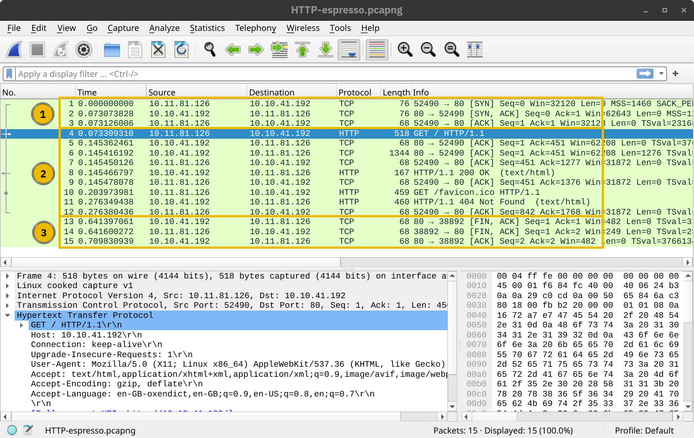
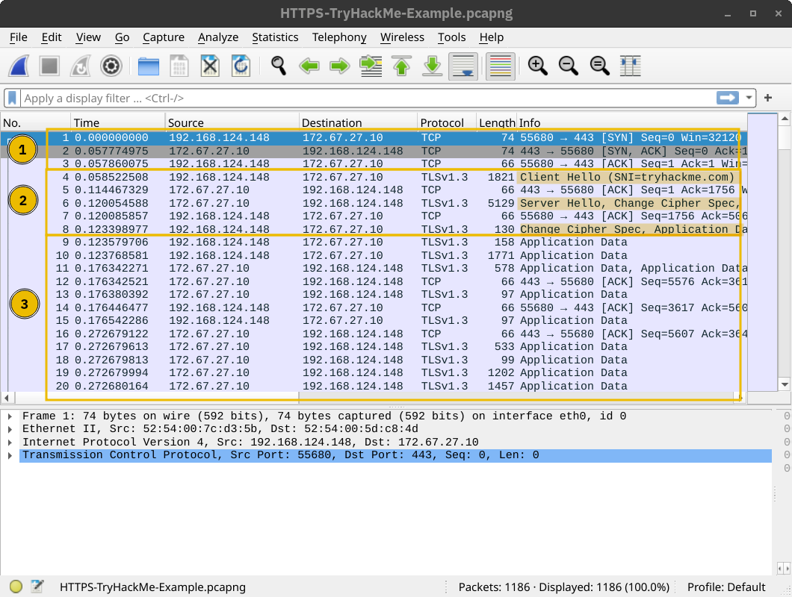

# Transport Layer Security(TLS)

Like SSL, its predecessor, TLS is a cryptographic protocol operating at the OSI model’s transport layer. It allows secure communication between a client and a server over an insecure network. By secure, we refer to confidentiality and integrity; TLS ensures that no one can read or modify the exchanged data. 

## Application Layer Protocols using TLS

Nowadays, tens of protocols have received security upgrades with the simple addition of TLS. Examples include HTTP, DNS, MQTT, and SIP, which have become HTTPS, DoT (DNS over TLS), MQTTS, and SIPS, where the appended “S” stands for Secure due to the use of SSL/TLS. In the following tasks, we will visit HTTPS, SMTPS, POP3S, and IMAPS.

## HTTP Over TLS

First here is the wireshark of normal HTTP communication.

1. is the initial handshake  
2. exchanging data
3. termination

Here is HTTP with TLS

1. initial tcp handshake
2. starting TLS session
3. rest of the story using TLS

If we have the key for encryption, wireshark can show the decrypted data on go.