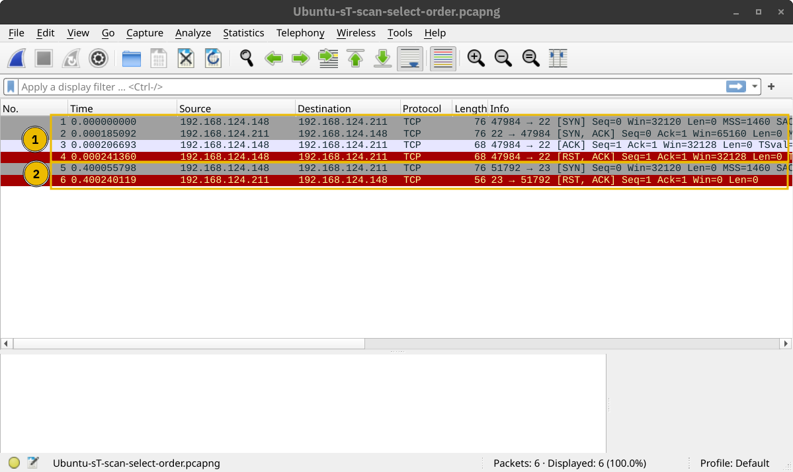

# Nmap(Network Mapper)

- IP range using -: If you want to scan all the IP addresses from 192.168.0.1 to 192.168.0.10, you can write 192.168.0.1-10
- IP subnet using /: If you want to scan a subnet, you can express it as 192.168.0.1/24, and this would be equivalent to 192.168.0.0-255
- Hostname: You can also specify your target by hostname, for example, example.thm

## Target ports

Nmap scans 1000 most common ports by default . Other options are:
- `-F` is for Fast mode, which scans the 100 most common ports (instead of the default 1000).
- `-p[range]` allows you to specify a range of ports to scan. For example, -p10-1024 scans from port 10 to port 1024, while -p-25 will scan all the ports between 1 and 25. Note that `-p-` scans all the ports and is equivalent to -p1-65535 and is the best option if you want to be as thorough as possible.

## Options

- `-sn`: For discovery of any type of TCP or UDP
- `-sL`: Only lists the host that are gonna be scanned
- `-sT`: Connect scan. Establishes 3 way handshake on every target TCP port.
- `-sS`: SYN scan. Unlike the Connect scan which establishes 3 way handshake, it only sends SYN packet. Advantages are that it logs less packets and is also stealty.
- `-sU`: UDP port scan.
- `-PA[port-list]`: TCP ACK discovery
- `-PS[port-list]`: TCP SYN discovery
- `-PU[port-list]`: UDP discovery

This screenshot shows -sT which sends ACK too

This screenshot shows -sS which only sends SYN
