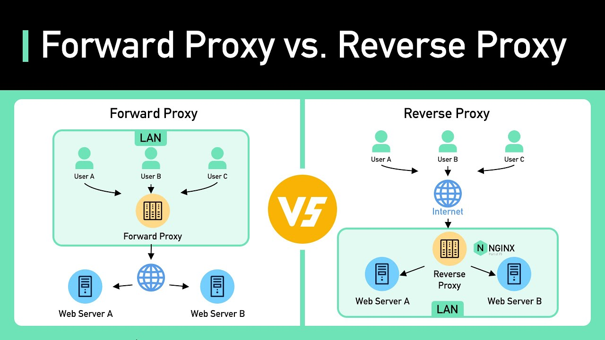

## Forward proxy

Acts as an intermediate between client and the servers.

## Reverse proxy

Acts as an intermediate between internet and the servers.

[Learn More and More Precise](https://medium.com/@asbedb/what-i-learned-deploying-nginx-proxy-manager-f47271d230d6)