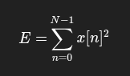

# VAD (Voice Activity Detection)

Also know as SAD (Speech Activity Detection). it's a technique used in speech processing to detect the presence or absence of human speech within an audio signal.

### Usage:

- **Bandwidth Efficiency (VoIP/Telephony)**: In a phone call, one person listens while the other speaks. VAD allows the system to stop transmitting data during silence, saving up to 50% of bandwidth (Discontinuous Transmission - DTX).
- **Automatic Speech Recognition (ASR)**: Empty background noise causes hallucination for the ASR.
- **Voice Assistants (Alexa/Siri)**: Detects the end of speech so it can run commands.

## How It Works?

A typical VAD system processes audio in small chunks called frames (usually 10ms to 30ms). The pipeline generally looks like this:

### Step A: Framing and Windowing

The continuous audio stream is sliced into overlapping frames. A window function (like Hamming or Hann) is often applied to minimize spectral leakage at the edges of the frames.

### Step B: Feature Extraction

The system extracts mathematical features from the frame to distinguish speech from noise. Common features include:

1. **Short-Term Energy**: Speech (especially vowels) usually carries more energy than background silence.

2. **Zero-Crossing Rate (ZCR)**: This counts how many times the signal oscillates across the zero axis.
3. **Spectral Flatness / Entropy**: Noise tends to have a “flatter” spectrum (white noise), while speech has peaks (formants).
4. Pitch (Fundamental Frequency - 𝐹0): Human voice has a harmonic structure. Detecting a pitch usually indicates voiced speech.

### Step C: Decision Engine

The features are compared against a model to make a decision.

1. **Energy-Based Thresholding (Legacy)** : The simplest method. If Energy > Threshold, it is speech. This fails easily in noisy environments or with quiet speakers. An adaptive threshold is often used:

Where 
𝛼 is a smoothing factor.

2. **Statistical Models (Gaussian Mixture Models - GMM)**: This approach assumes speech and noise follow specific probability distributions (usually Gaussian). It calculates a Likelihood Ratio (LR). 

3. **Deep Learning (Modern)**: Modern VADs use Neural Networks (DNNs, RNNs, LSTMs, or CNNs). These models are trained on massive datasets containing speech mixed with various types of noise (traffic, wind, babble). They learn complex, non-linear relationships that simple math cannot capture.

### Step D: The Hangover Mechanism (Smoothing)

A raw VAD output is “jittery.” It might detect speech for 5ms, silence for 10ms, then speech again. This cuts off the ends of words.

To fix this, a Hangover Scheme is used:

- Attack Time: How quickly it switches to “Speech” (must be fast to catch the start of a word).
- Release Time (Hangover): Once speech stops, the VAD waits (e.g., 200ms) before switching to “Silence.” If speech resumes within that time, it remains active.

## Categories of VAD Algorithms

### **WebRTC VAD**

Developed by Google for the WebRTC project.

- Method: Uses Gaussian Mixture Models (GMM) on sub-band signal energy.
- Pros: Extremely fast, lightweight, runs on embedded devices, standard in industry.
- Cons: Struggles with non-stationary noise (sudden loud bangs) and is less accurate than modern AI models.

### **Silero VAD**

A modern, pre-trained enterprise-grade VAD.

- Method: Deep Neural Network.
- Pros: Highly accurate, ignores non-human sounds (like a dog barking or a door slamming) which energy-based VADs would mistake for speech.
- Cons: Requires slightly more compute than WebRTC (though still very optimized).

## Problems

- **The Cocktail Party Problem**: Distinguishing the target speaker from other speakers in the background. Standard VAD detects any speech. (Requires Speaker Diarization/Isolation to solve).
- **Non-Stationary Noise**: Sounds that change quickly (keyboard typing, siren, dishes clattering) often have high energy and high frequency, fooling simple VADs.
- **Unvoiced Consonants**: The sounds /f/, /s/, /h/ have very low energy and look like noise. An aggressive VAD will cut these off, making “Stop” sound like “Top”.
- **Low SNR**: When the noise is almost as loud as the speech, traditional energy detection fails completely. This is where Deep Learning models excel.