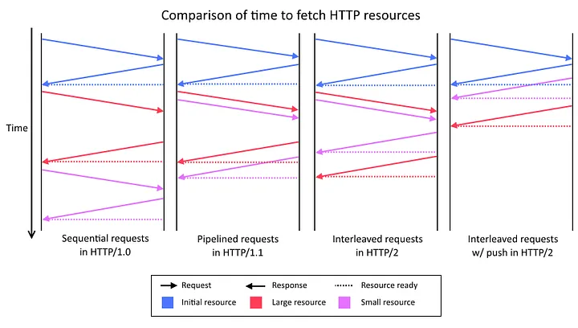

# Difference between 1, 2 and 3

HTTP/1.1 released in 1997 by IETF

## Problems with legacy HTTP/1.1
- Head of line blocking problem (HOL)
- No request pipelining and multiplexing
- Opens multiple TCP connections
- Data transfer is textual
- Headers are long
- Slow

Most of these are because the implementation of HTTP/1.1

### Head Of Line Blocking (HOL)

It refers to issue where browser/client has to wait for the requests prior to it to complete before it can fire of another

It blocks the subsequent ones on the same TCP connection.

Analogy: Trains arriving at a station. If the first train is delayed, all subsequent trains have to wait.

Browsers open multiple TCP connections to mitigate this issue.
But chrome and firefox have a limit of 6 connections per domain.

### No request pipelining and multiplexing

In HTTP/1.1 the concept of pipelining concurrent requests was introduced. This way a single http connection could be used to send multiple requests without waiting for the response of the previous one.

Pipelining must have brought huge improvements to HTTP/1.x performance but, for a number of reasons, it was difficult to implement, easy to break, and not well supported on either web browser or web server sides.

### Opens multiple TCP connections

Overall, it boosted the performance of HTTP/1.1.

**Problems:**
- Opening a TCP connection itself takes some time.
- Problems with wireless connections. As the bandwidth is limited, it can lead to congestion and packet loss. So the TCP connection will be smaller and throughput will decrease and latency will increase.

### Data transfer is textual

Textual data transfer is readable and easy to reimplement and also easy to debug.

However, binary protocols used ing HTTP/2 and HTTP/3 are more compact in terms of data transfer.

**Problems:**
- It is not efficient for large data transfers.
- Error-Prone as it has many helpers to deal with whitespace , capitalization and line ending.
- Binary are more secure.

### Headers are long

Each HTTP/1 request and response includes many headers and also there is no reusing procedure.

## Workaround these problems

- ### Domain Sharding:
    Developers move some of the api's under different domains so that browsers can open more than 6 connections per domain.
- ### CSS Spriting
    Combining multiple images into a single image file to reduce the number of HTTP requests.

## HTTP/2
- More efficient use of network resources by  allowing multiple concurrent exchanges on the same connection.
- Header field compression
- Prioritizing of requests

### Terminology of HTTP/2
- **Stream**: A bidirectional flow of bytes within a connection, identified by a stream identifier.
- **Message**: A complete sequence of frames that form a request or response.
- **Frame**: The smallest unit of communication in HTTP/2, each containing a frame header which at minimum identifies which stream it belongs to.

Frames -> Messages -> Streams -> A single TCP connection

**It is widely supported by many browsers.**

### Multiplexing and Streams in HTTP/2

The streams of HTTP/2 is a bi-directional sequence of frames that share a common identifier (stream id). The client and server break down the HTTP message into independent frames, interleaves them and reassembles it at the other end. A single TCP connection can have hundreds of streams.

Interleaving fixes HOL problem.

Reducing header sizes using HPACK improves performance and eases caching

### Server Push

Another powerful new feature of HTTP/2 is the ability of the server to send multiple responses for a single client request. That is, in addition to the response to the original request, the server can push additional resources to the client without the client having to request each one explicitly.

## HTTP/2 Problems