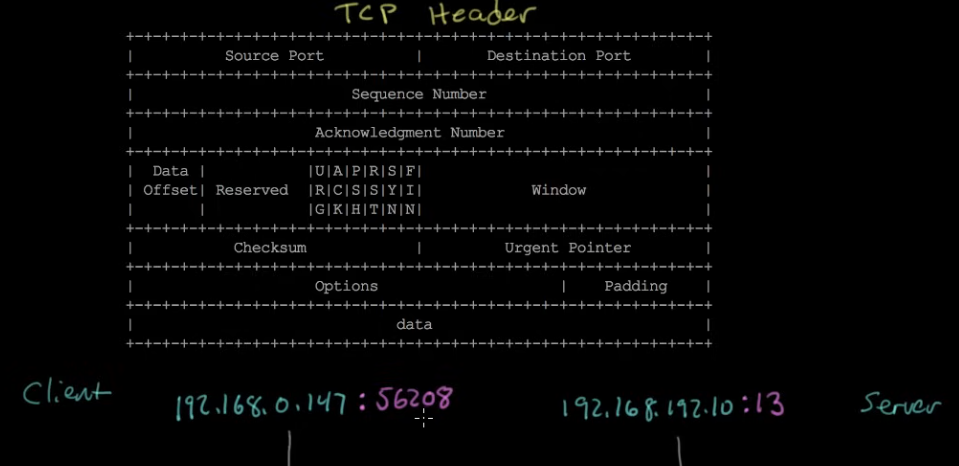
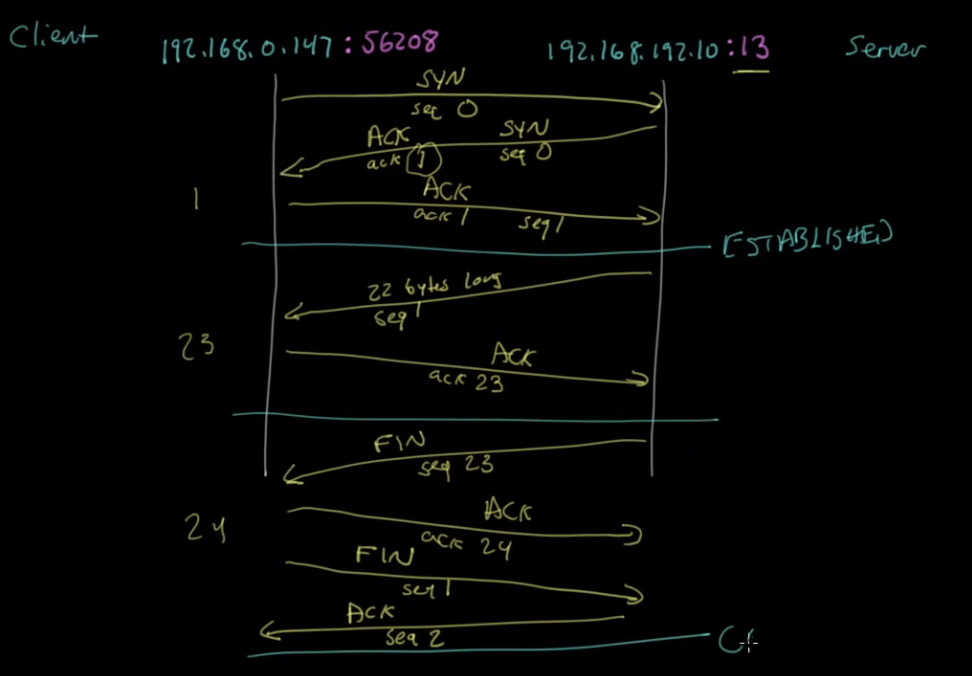

# TCP/IP for Programmers

Language that systems use to talk to eachothers.

## Logical vs Physical

Cloud -> Modem -> Router -> Switch -> Access Point -> Computer

all of these logical components are in a physical device called a *SOHO Router*.

## The Whole Flow

- A: I want to talk to you
- B: I acknowledge that you want to talk to me, I also want to talk to you
- A: I acknowledge that you want to talk to me
- A: The weather today is nice
- B: Indeed
- B: The wind makes me want to go for a walk
- A: Indeed
- A: I need to go now
- B: I acknowledge that you need to go
- B: I need to go now
- A: I acknowledge that you need to go

### The whole flow visualized

## Network Layers

- Application Layer
- Presentation Layer
- Session Layer
- Transport Layer
- Network Layer
- Data Link Layer
- Physical Layer

### Upper layers (for server peeps)
- Application Layer
- Presentation Layer
- Session Layer

### Lower layers (for network engineers)
- Network Layer
- Data Link Layer
- Physical Layer

neither sides take blame for the Transport Layer