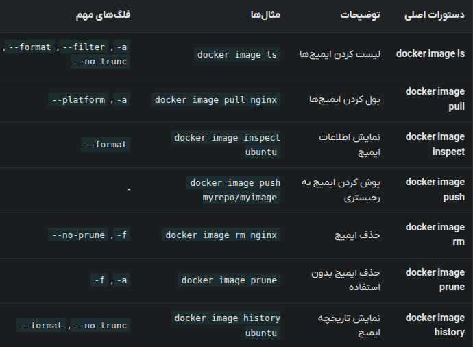
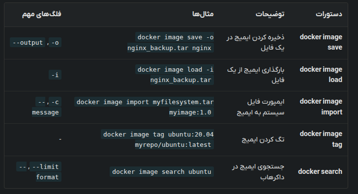
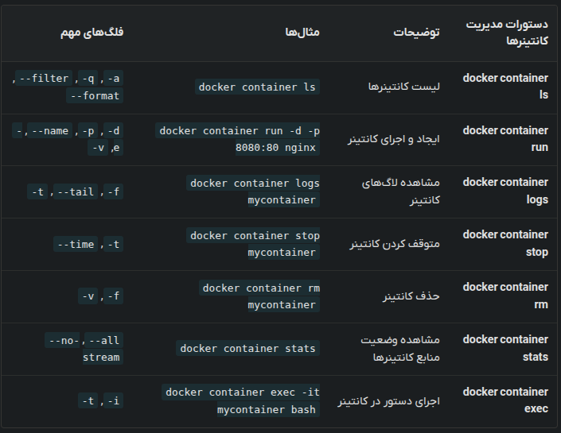
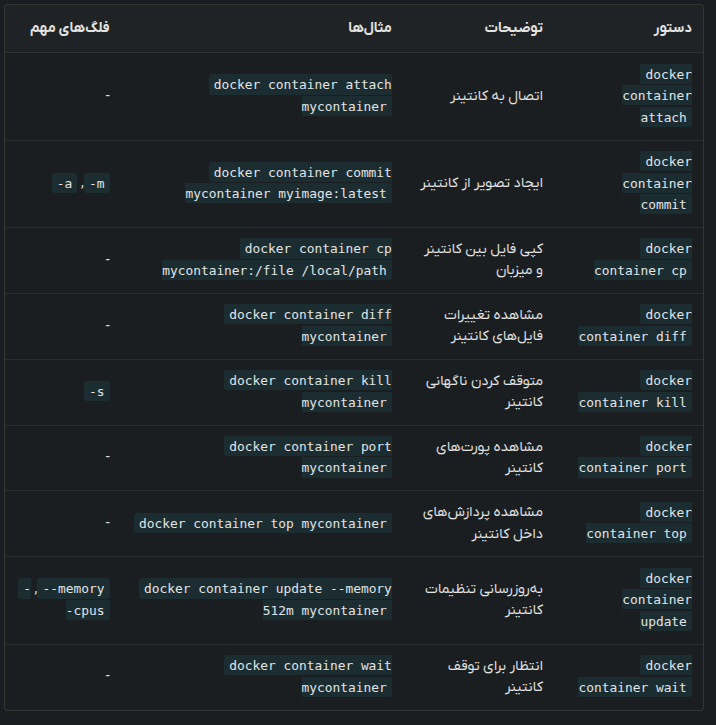
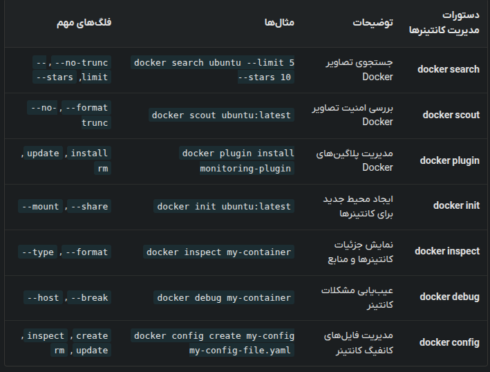

# Docker Commands

This guide covers essential Docker commands for working with images and containers.

## Working with Images

### Listing Images
```bash
# List all downloaded images
docker image ls

# Show all images including dangling ones
docker image ls -a

# Specify a repository
docker images alpine
```

### Pulling Images
```bash
# Pull an image from a registry
docker image pull IMAGE_NAME[:TAG]

# Specify the CPU architecture
docker image pull --platform linux/amd64 alpine:3.21.3
```

### Inspecting Images
```bash
docker image inspect redis
```

### Pushing Images to a Registry
Before pushing, you must authenticate with the registry:
```bash
docker login
```

Tag the image appropriately:
```bash
docker image tag SOURCE_IMAGE TARGET_IMAGE
```

Push the image:
```bash
docker image push myrepo/myimage:1.0
```

### Deleting Images
```bash
docker image rm IMAGE_NAME
```

> **Note**: Removing an image with a running container will result in an error. Use the `-f` flag to force removal.

To remove unused images and free up space:
```bash
docker image prune
```



### Saving and Loading Images
```bash
# Save images to a tar archive
docker image save -o nginx_backup.tar nginx
docker image save -o images_backup.tar ubuntu nginx redis

# Load images from a tar archive
docker image load -i FILE_NAME.tar
```

### Tagging Images
```bash
docker image tag SOURCE_IMAGE[:TAG] TARGET_IMAGE[:TAG]
docker image tag ubuntu:20.04 myrepo/ubuntu:latest
docker image tag nginx myrepo/nginx:v2.0
```

### Importing Images
Creates an image from a tar file or a URL. Unlike `docker image load`, the imported package doesn't necessarily need to be a Docker image.
```bash
docker image import myfilesystem.tar myimage:1.0
docker image import -c "CMD ['bash']" myfilesystem.tar myimage:latest
docker image import http://example.com/filesystem.tar myimage:latest
```

### Searching for Images
```bash
docker search php
docker search --filter=stars=3 php
docker search --limit=1 php
docker search --filter is-official=true mongo
```



## Working with Containers

### Listing Containers
The following commands are equivalent:
```bash
docker container ls
docker ps
```

### Running Containers
The `run` command creates and starts a new container.
```bash
docker container run nginx
docker container run -d -p 8080:80 nginx
docker container run -d --name mynginx -e ENV_VAR=production nginx
```

- `--name`: Specify a name for the container.
- `-d`: Run the container in the background (detached mode).
- `-e`: Set environment variables.
- `-v`: Mount a volume.
- `-p`: Map ports (host_port:container_port).
- `--rm`: Automatically remove the container and its resources when it stops.

> **Tip**: Arguments before the image name are passed as Docker settings, while arguments after the image name are passed as flags for the `ENTRYPOINT`.

### Viewing Logs
```bash
docker container logs mycontainer
docker container logs -f mycontainer
docker container logs --tail 10 mycontainer
```

- `-f`: Live streaming of logs.
- `--tail`: Show a specific number of recent log lines.
- `-t`: Add timestamps to logs.

### Stopping Containers
Docker sends a `SIGTERM` signal to processes in the container before stopping. Use `-t` to specify a grace period before sending `SIGKILL`.
```bash
docker container stop mycontainer
docker container stop container1 container2
```

### Removing Containers
```bash
docker container rm mycontainer
docker container rm -f mycontainer
docker container rm -v mycontainer
```

- `-f`: Force removal of a running container.
- `-v`: Remove the volumes associated with the container.

### Monitoring Performance
```bash
docker container stats
docker container stats mycontainer
docker container stats --no-stream
```

### Executing Commands
```bash
# Run a command in a running container
docker container exec -it mycontainer bash
docker container exec mycontainer ls /app
```

- `-i`: Interactive mode.
- `-t`: Allocate a pseudo-TTY.



### Attaching to Containers
Connects the I/O of your terminal to a running container. To detach without stopping the container, use `CTRL + P` followed by `CTRL + Q`.

### Committing Changes
Creates a new image from the current state of a container.
```bash
# -m: Commit message, -a: Author
docker container commit mycontainer myimage:latest
```

### Copying Files
```bash
docker container cp mycontainer:/path/to/file /local/path
docker container cp /local/path mycontainer:/path/to/file
```

### File System Changes
Shows the list of deleted, changed, and added files in a container.
```bash
docker container diff mycontainer
```

### Killing Containers
Sends a `SIGKILL` by default. You can specify a different signal with `-s`.
```bash
docker container kill -s SIGTERM mycontainer
```

### Port Mapping and Processes
```bash
# Show port mappings
docker container port mycontainer

# List processes running in the container
docker container top mycontainer
```

### Updating Resources
Update the resources allocated to a container on the fly.
```bash
docker container update --memory 512m --cpus 1 mycontainer
```

### Waiting for Containers
Wait until a container stops and print its exit code.
```bash
docker container wait mycontainer
```



## Additional Tools

### Docker Scout
Analyzes images for vulnerabilities and security concerns.
```bash
docker scout ubuntu:latest
```

### Plugins
Manage Docker plugins.
```bash
docker plugin install <plugin-name>
```

### Docker Init
Initializes a project with Dockerfile, docker-compose, and .dockerignore files.
```bash
docker init
```

### Docker Debug
Debugs a running container.
```bash
docker debug CONTAINER
```

