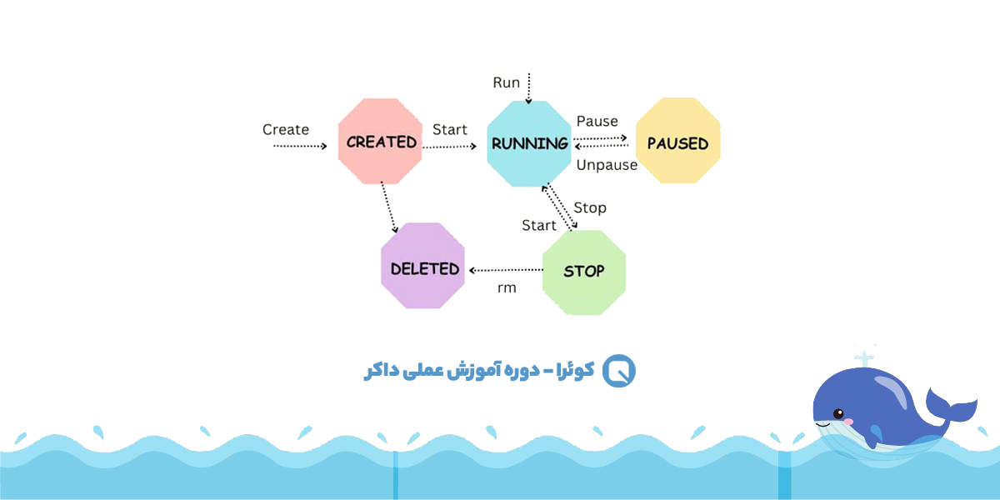
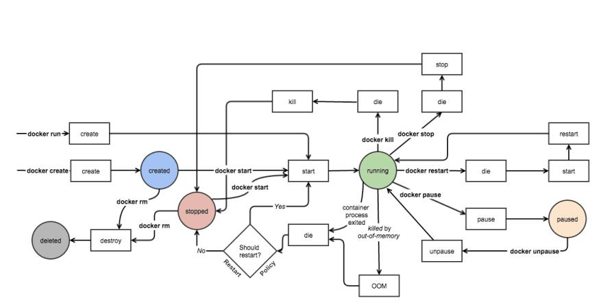

# Container Lifecycle

Understanding the lifecycle of a Docker container is crucial for managing applications effectively. A container moves through several states from creation to deletion.

## Container States

- **Created**: The container has been created from an image, but it has not been started yet. No processes are running inside it.
- **Running**: The container is active and its main process is executing. In this state, you can view logs, execute commands, and interact with the container.
- **Paused**: All processes in the container are suspended (frozen). The container remains in memory, but it does not consume CPU cycles. You can use the `unpause` command to resume it.
- **Stopped**: The container's main process has been terminated. The container still exists in the Docker engine's storage, and its state (including its filesystem) is preserved. It can be restarted.
- **Deleted/Removed**: The container and its associated metadata are completely removed from the system. Any data not stored in a volume is lost.

## Lifecycle Commands

| Action | Command | Resulting State |
| :--- | :--- | :--- |
| Create | `docker create` | Created |
| Start | `docker start` | Running |
| Run | `docker run` | Created -> Running |
| Pause | `docker pause` | Paused |
| Unpause | `docker unpause` | Running |
| Stop | `docker stop` | Stopped |
| Kill | `docker kill` | Stopped (Forceful) |
| Remove | `docker rm` | Deleted |