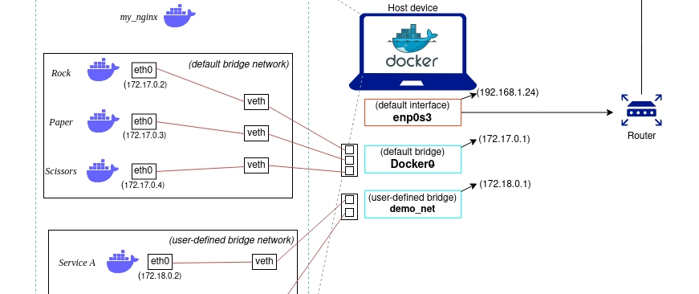

# Docker Networking

Docker networking allows containers to communicate with each other and with the host or external networks. Each container is assigned its own network stack, and Docker uses network drivers to manage this connectivity.

## Core Concepts

- **Network Interface**: Docker creates a virtual interface (typically `docker0`) on the host to manage container traffic. You can view network interfaces using the `ip route` or `ip addr` command.
- **Network Drivers**: Drivers define how the network is structured and how containers communicate.

## Common Commands

### Manage Networks
```bash
# List all networks
docker network ls

# Create a new network
docker network create -d bridge my-network

# Remove a network
docker network rm my-network

# Remove all unused networks
docker network prune
```

### Inspect and Connect
```bash
# Display detailed information about a network
docker network inspect my-network

# Connect a running container to a network
docker network connect my-network <container-name>

# Disconnect a container from a network
docker network disconnect my-network <container-name>
```

## Network Drivers

### Bridge (Default)
The `bridge` driver is the default network driver. It creates a private network internal to the host so containers on that network can communicate.



- **Functionality**: Each container gets a unique internal IP address.
- **Access**: External access is managed via Port Forwarding (NAT).

### Host
The `host` driver removes network isolation between the container and the Docker host, allowing the container to use the host's networking directly.

- **Performance**: High performance as it bypasses NAT.
- **Security**: Lower isolation; the container can access any service on the host's network.

### Overlay
The `overlay` driver creates an internal network that spans multiple Docker hosts. This is essential for multi-host clusters like Docker Swarm or Kubernetes.

- **Usage**: Enables communication between containers on different physical or virtual hosts.

### Macvlan
The `macvlan` driver allows you to assign a MAC address to a container, making it appear as a physical device on your network.

- **Functionality**: Containers can be assigned IPs directly from the physical network's subnet.

### IPvlan
`ipvlan` is similar to `macvlan` but gives you more control over IPv4 and IPv6 addressing.

- **L2 Mode**: Similar to Macvlan (Layer 2).
- **L3 Mode**: Traffic is routed via the host (Layer 3).

### None
The `none` driver disables all networking for a container. The container only has a loopback interface.

## Summary Table

| Driver | Description | Best For |
| :--- | :--- | :--- |
| **Bridge** | Default private network on a single host. | Standard standalone containers. |
| **Host** | Uses the host's network stack directly. | High-performance applications. |
| **Overlay** | Multi-host network. | Swarm services and multi-node clusters. |
| **Macvlan** | Assigns a MAC address to containers. | Legacy apps needing direct network access. |
| **None** | No networking. | Isolated workloads. |
