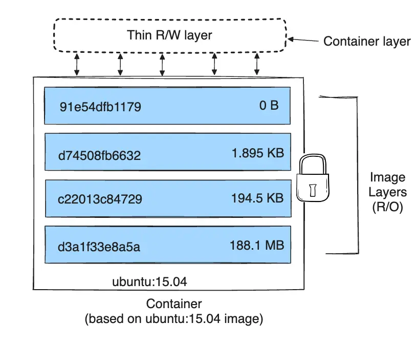

# Docker Volumes

By default, data created inside a Docker container is stored in a writable container layer. If the container is deleted, this data is lost. Docker volumes provide a mechanism for persisting data beyond the lifecycle of a container.



## Persistent Data in Docker

Without a volume, a container is stateless. For example, if you run a Redis container and save data, that data will disappear once the container is removed.

### Using Volumes with `docker run`

To persist data, you can use the `-v` or `--mount` flag.

```bash
# Using a named volume 'redis_data'
docker run --rm --name redis -v redis_data:/data -d redis --appendonly yes
```

In this example, the data stored in `/data` inside the container will be persisted in a Docker-managed volume named `redis_data`.

### Read-Only Volumes
You can restrict a container to read-only access by adding `:ro` to the volume mapping:
```bash
docker run --rm --name redis -v redis_data:/data:ro -d redis
```

### Anonymous Volumes
If you don't specify a name for the volume, Docker creates an anonymous volume with a random hash as its name.
```bash
docker run --rm -v /data redis
```

## Mounting Types

### Docker Volumes
Managed by Docker and stored in a part of the host filesystem (`/var/lib/docker/volumes/` on Linux). They are the best way to persist data in Docker.

### Bind Mounts
Map a file or directory on the host machine to a directory in the container.
- **Usage**: Good for development (e.g., mounting source code into a container).
- **Control**: Bind mounts are dependent on the directory structure of the host.

### tmpfs Mounts
Stored in the host's system memory (RAM) and never written to the host's filesystem.
- **Usage**: Good for sensitive data or temporary files that require high performance.

## Volume Commands

### List Volumes
```bash
docker volume ls
```

### Create a Volume
```bash
docker volume create \
  --driver local \
  --label environment=production \
  my_volume
```

### Inspect a Volume
```bash
docker volume inspect my_volume
```

### Remove Volumes
```bash
# Remove a specific volume
docker volume rm my_volume

# Remove all unused volumes
docker volume prune
```

## Advanced Mounting Examples

### Bind Mounting source code
```bash
docker run -d \
  --name dev-app \
  -v $(pwd)/src:/app/src \
  myapp
```

### Using `tmpfs` for performance
```bash
docker run -d \
  --name cache-app \
  --tmpfs /app/cache:size=100m,mode=1777 \
  nginx:alpine
```

### Using `--mount` (Recommended)
The `--mount` flag is more explicit and verbose than `-v`.
```bash
docker run -d \
  --name my-app \
  --mount type=volume,source=my-vol,target=/app/data \
  nginx
```