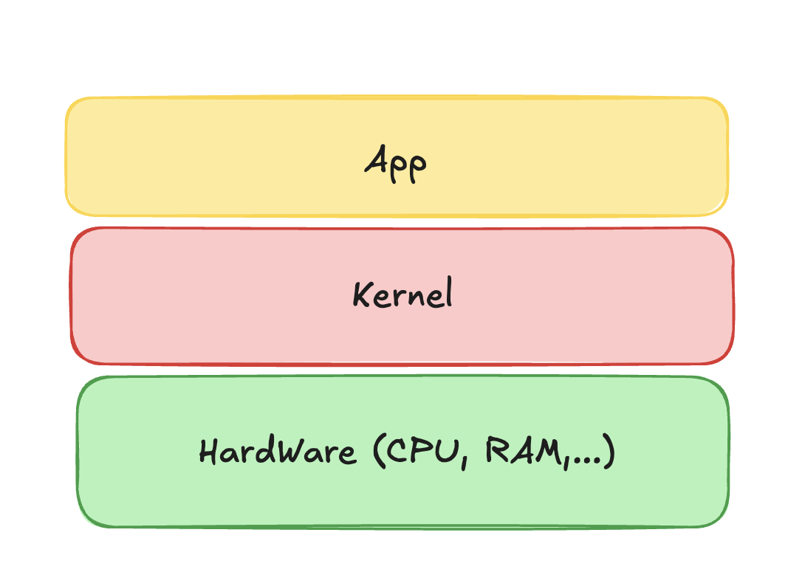
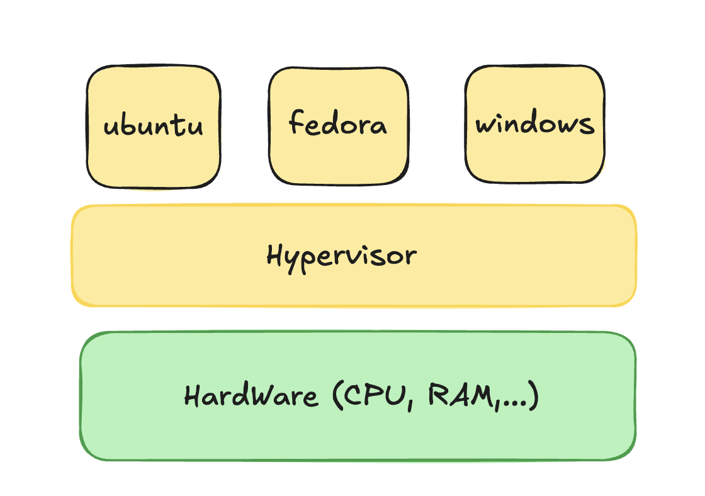
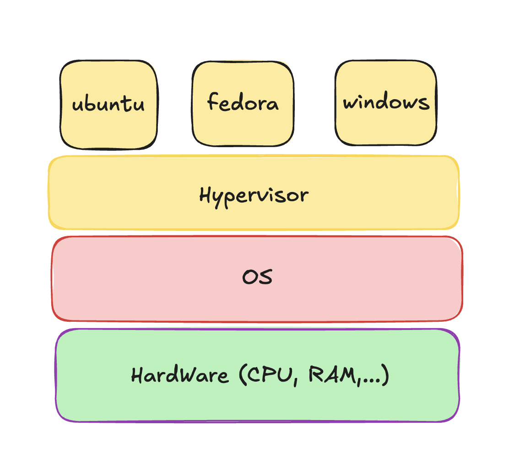
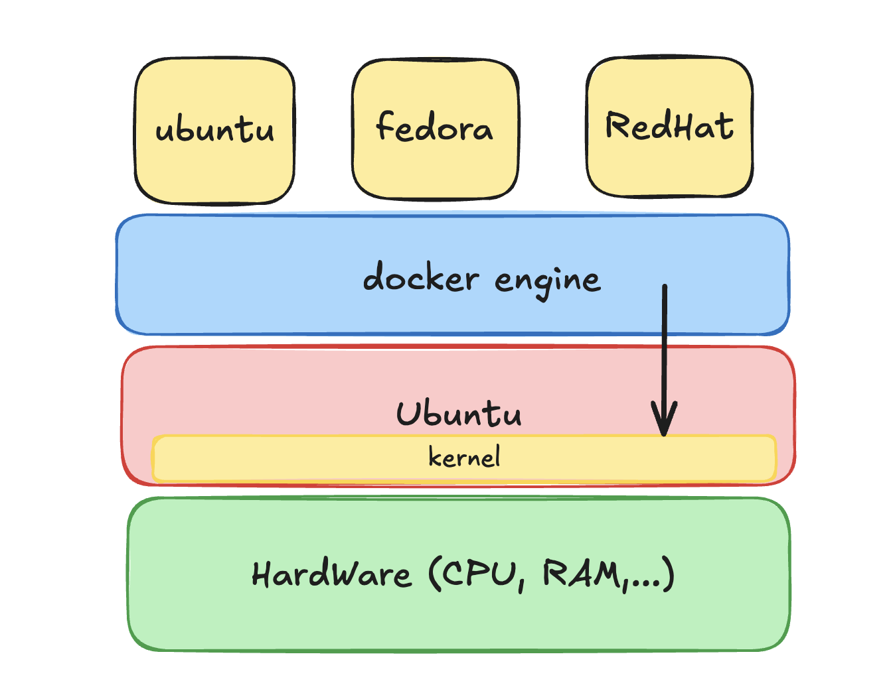
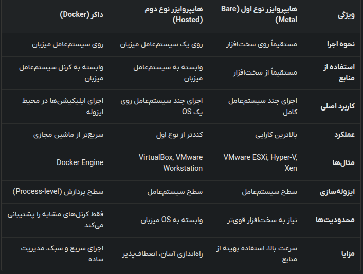

# Hypervisors and Virtualization

To run multiple operating systems on a single physical machine, we need to efficiently distribute hardware resources (CPU, RAM, storage) across these systems. This is achieved through virtualization.

## What is a Hypervisor?

A hypervisor (or Virtual Machine Monitor, VMM) is software, firmware, or hardware that creates and runs virtual machines (VMs). It acts like a resource manager:

- **Host Machine**: The physical server.
- **Hypervisor**: The "receptionist" that manages and distributes resources.
- **Guest OS**: The individual operating systems running as VMs.

## Types of Hypervisors

### Type 1: Bare Metal
These hypervisors run directly on the host's hardware to control the hardware and manage guest operating systems.
- **Examples**: VMware ESXi, Microsoft Hyper-V, Xen.

### Type 2: Hosted
These hypervisors run on a conventional operating system (the host OS) just like other computer programs.
- **Examples**: Oracle VirtualBox, VMware Workstation, Parallels Desktop.

## Docker vs. Hypervisors

It is important to understand that **Docker is not a hypervisor**. While hypervisors virtualize the hardware, Docker virtualizes the operating system.

- **Hypervisor**: Each VM includes a full copy of an operating system, the application, and necessary binaries and libraries. This makes VMs heavy and slow to start.
- **Docker**: Containers share the host system's kernel and isolate the application processes from the rest of the system. This makes containers lightweight and extremely fast to start.

### Platform Compatibility
Since Docker containers share the host kernel:
- You cannot run a native Windows container directly on a Linux kernel.
- However, tools like **WSL 2** (Windows Subsystem for Linux) allow Windows to run a Linux kernel, enabling Linux containers to run on Windows machines.

