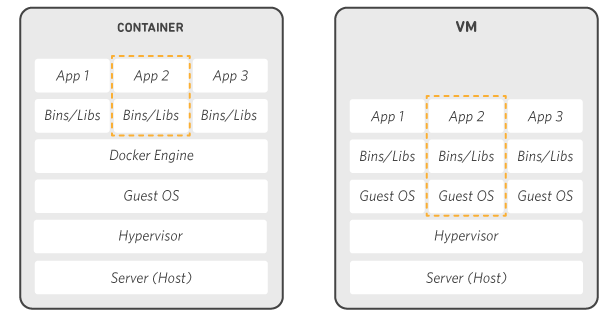

# What is Docker?

Docker is a platform that allows you to automate the deployment, scaling, and management of applications using containerization. Unlike Virtual Machines, Docker doesn't need to run a whole OS for each container, making it much more lightweight and efficient.

## Core Concepts

- **Image**: A read-only template that contains the application code, libraries, and dependencies required to run an application. We use images to build containers.
- **Container**: A lightweight, standalone, and executable package of software that includes everything needed to run an application. It is a running instance of an image.
- **Docker Engine**: The core software that handles and controls containers on your host system.
- **Docker Hub / Registry**: An online service (registry) for storing and sharing Docker images.
- **Dockerize / Containerize**: The process of moving an application into Docker containers.

## How Docker Works

Containers interact with the host kernel directly, allowing each container to share processing and storage resources with other containers and the host system.

Containers are logically isolated, meaning they do not affect other containers or the host system's stability.

- **Docker Daemon**: Interacts with the Docker client through RESTful APIs to manage images and containers.
- **containerd**: A container runtime that manages the lifecycle of a container (start, stop, pause, delete).
- **Shim API**: Acts as a bridge between `containerd` and the low-level runtime.
- **OCI Runtime**: Controls low-level kernel features like namespaces and Cgroups (Control Groups) to provide isolation and resource management.

Containers are essentially processes running on the host, but they are isolated from other processes and have their own dedicated resources like file systems and network stacks.