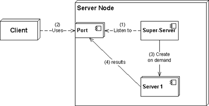

# Host Security

### `/etc/nologin`

If you create and write something in it, the content will be shown to any person who tries to login into the system and with that file the login attempt will fail. It is useful for maintenance time. Delete this file and the users will be able to login again.

> the root user will be able to login even in the presence of `/etc/nologin`

There is a dummy shell called nologin and you can set it as shell for any user you want to prevent from being able to login into the system via a shell. Note that such a user still has an active account and will be able to use other services (say email or ftp) but wont be able to enter the shell.

```shell
sudo usermod -s /sbin/nologin baduser
```

### super-servers

A super-server or sometimes called a service dispatcher is a type of daemon running mostly on Unix-like systems for security and resource management reasons. It listens for requests its configured for and starts the target services when needed to answer the requests. This adds a layer of security to your communications and also lets some of the services to be inactive when we do not need them. You can see a super server or superdaemon as a TCP (and UDP or even ICMP) wrapper around other services.



Few GNU/Linuxes use TCP wrappers like xinetd these days but you might see it in some installations or traces of it in your `/etc/xinet.d`. If needed it is also possible to configure the `systemd.socket` as a TCP wrapper for other services.

xinetd configuration file example:

```
service telnet
{
disable         = no
flags           = REUSE
socket_type     = stream
wait            = no
user            = root
server          = /usr/sbin/in.telnetd
log_on_failure  += USERID
no_access       = 10.0.1.0/24
log_on_success  += PID HOST EXIT
access_times    = 09:45-16:15
}
```

If we change the `disable` to `yes` and restart the `xinetd`, the telnet daemon will start running. There are a few files to control `xinetd` related files.

`xinetd` is replaced by the `systemd.socket` units. Some services like `ssh` and `cups` might have a socket unit alongside the service unit

### `/etc/hosts.allow` and `/etc/hosts.deny`

These two files will allow or deny access from specific hosts. Its logic is like cron.deny and cron.allow.

```text
# /etc/hosts.allow: list of hosts that are allowed to access the system.
#                   See the manual pages hosts_access(5) and hosts_options(5).
#
# Example:    ALL: LOCAL @some_netgroup
#             ALL: .foobar.edu EXCEPT terminalserver.foobar.edu
#
# If you're going to protect the portmapper use the name "rpcbind" for the
# daemon name. See rpcbind(8) and rpc.mountd(8) for further information.
#

vsftpd: 10.10.100.
```

