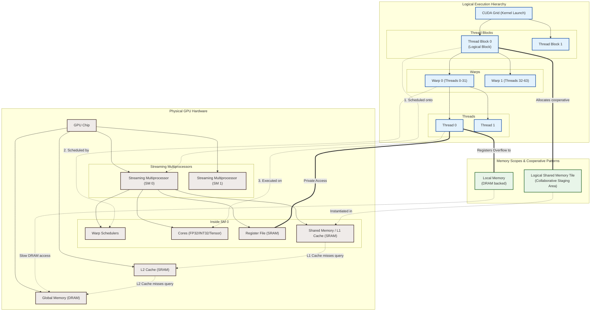

# CUDA Memory and Execution Hierarchy

To write efficient CUDA programs, it is critical to understand how the **logical execution hierarchy** maps to the **physical hardware architecture**, and how the **memory hierarchy** boundaries dictate access and performance.

This document provides a comprehensive map of these relationships, complete with a Mermaid visualization.

---

## 1. Unified Architecture Mapping

The diagram below shows how the logical abstractions (Grid, Block, Warp, Thread, Tile) map onto the physical GPU resources (SM, Cores, Registers, L1/L2 Cache, and DRAM).

---

## 2. Core Concepts Defined

### 2.1 Execution Units

* **Grid**:
    * **Logical**: The complete set of threads generated by a single kernel invocation (e.g., `kernel<<<blocks, threads>>>()`).
    * **Physical**: Span across the entire GPU chip, utilizing all available Streaming Multiprocessors (SMs).
* **Thread Block (Block)**:
    * **Logical**: A user-defined group of threads. Threads inside the same block can synchronize with each other using `__syncthreads()` and share data through shared memory.
    * **Physical**: A block is scheduled entirely onto a **single SM**. It cannot be split across multiple SMs. If an SM runs out of registers or shared memory, it limits the number of concurrent blocks it can host.
* **Warp**:
    * **Logical**: A hardware-managed subgroup of 32 threads within a block.
    * **Physical**: The SM's Warp Scheduler selects one or more ready warps and broadcasts a single instruction to all 32 threads in parallel (SIMT model).
* **Thread**:
    * **Logical**: The individual execution path.
    * **Physical**: Executed on individual pipelined CUDA cores (ALUs).

---

### 2.2 Memory Units & Patterns

* **Registers**:
    * **Scope**: Private to each individual thread.
    * **Speed**: Fast, single-cycle latency. Located in the SM's physical Register File.
    * **Spillover**: If a thread exceeds its register limit, variables spill over to **Local Memory**, which is physically stored in slow global DRAM (though cached in L1/L2).
* **Shared Memory & L1 Cache**:
    * **Scope**: Shared among all threads within a single block.
    * **Speed**: Low-latency, high-bandwidth on-chip SRAM (~100x faster than DRAM).
    * **Relation**: On modern GPUs, the physical on-chip SRAM is shared between L1 Cache and Shared Memory. The ratio of allocation can often be configured dynamically.
* **Tile**:
    * **Scope**: A design pattern (not a direct hardware entity). It is a logical subarray allocated in shared memory where threads cooperatively load a chunk of global memory data.
    * **Purpose**: Allows threads to perform multiple calculations on the same data locally, avoiding redundant, high-latency trips to global memory.
* **L2 Cache**:
    * **Scope**: Shared across all SMs on the GPU.
    * **Speed**: Faster than DRAM, slower than L1/Shared Memory.
* **Global Memory (DRAM)**:
    * **Scope**: Accessible by all grids and threads on the GPU device, as well as the CPU host (via PCIe transfers).
    * **Speed**: High latency (100–400+ clock cycles), high capacity.
