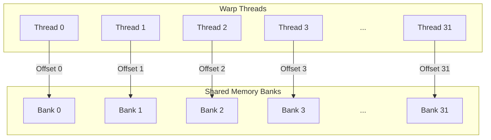
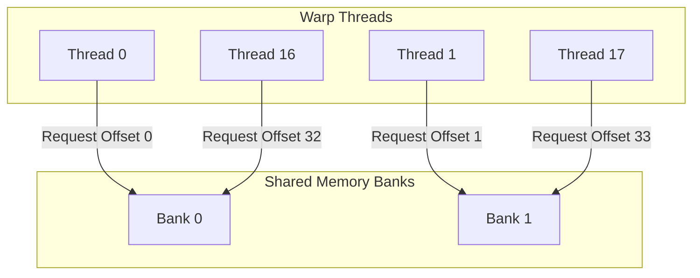
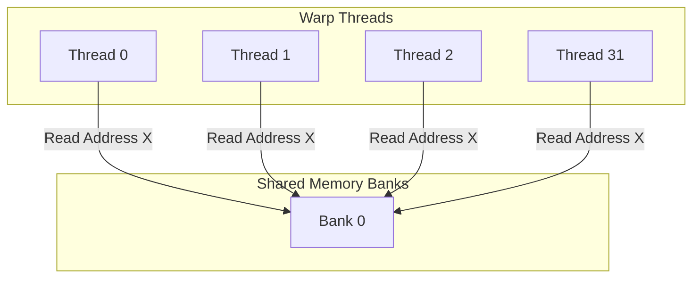

# Shared Memory and Bank Conflicts

In multi-core and heterogeneous parallel computing, memory access speed is the primary bottleneck. To bridge the latency gap between fast processing cores and slow main memory (DRAM), hardware architectures introduce intermediate, high-speed memories. 

This document explores **Shared Memory** across both CPU and GPU architectures, with a deep dive into **Shared Memory Banks** and the performance-limiting phenomenon known as **Bank Conflicts**.

> [!NOTE]
> For a visual overview of how shared memory fits into the broader execution model and memory landscape, see the [CUDA Memory and Execution Hierarchy](file:///home/kshyst/Desktop/Docs/Docs/docs/MultiCore_Computing/CUDA%20Memory%20and%20Execution%20Hierarchy.md) document.

---

## 1. CPU Shared Memory Architectures

In traditional multi-core CPU architectures, "shared memory" refers to the system's main random-access memory (RAM) and the shared cache hierarchy (typically L3 cache) accessed by multiple CPU cores.

```
┌─────────────────────────────────────────────────────────┐
│                       Main Memory                       │
└────────────────────────────┬────────────────────────────┘
                             │
              ┌──────────────┴──────────────┐
              ▼                             ▼
       ┌─────────────┐               ┌─────────────┐
       │  L3 Cache   │               │  L3 Cache   │
       └──────┬──────┘               └──────┬──────┘
              │                             │
       ┌──────┴──────┐               ┌──────┴──────┐
       ▼             ▼               ▼             ▼
  ┌─────────┐   ┌─────────┐     ┌─────────┐   ┌─────────┐
  │L1/L2    │   │L1/L2    │     │L1/L2    │   │L1/L2    │
  │Cache    │   │Cache    │     │Cache    │   │Cache    │
  └────┬────┘   └────┬────┘     └────┬────┘   └────┬────┘
       ▼             ▼               ▼             ▼
    [Core 0]      [Core 1]        [Core 2]      [Core 3]
```

### SMP (Symmetric Multiprocessing)
* **Definition**: A multi-core architecture where two or more identical processors connect to a single, shared main memory.
* **Characteristics**:
    * **Uniform Memory Access (UMA)**: All cores share the physical memory space with equal access times (latency and bandwidth) through a system bus or crossbar interconnect.
    * **Scalability Limit**: As the number of cores increases, the shared system bus becomes a major bottleneck due to contention.

### NUMA (Non-Uniform Memory Access)
* **Definition**: An architecture designed for multi-socket servers where memory is divided into local regions dedicated to specific CPU sockets.
* **Characteristics**:
    * **Non-Uniform Access**: A processor can access its own **local memory** (connected directly to its socket) much faster than **remote memory** (connected to other sockets via interconnects like Intel UPI or AMD Infinity Fabric).
    * **Optimization**: Operating systems and programmers must employ "NUMA-aware" memory allocation to keep data local to the thread working on it.

### Cache Coherency
Since each CPU core has its own private L1 and L2 caches, copying data from the shared main memory into private caches creates a coherency problem: if Core 0 modifies its cached copy of address `X`, Core 1 must be notified so it does not read stale data from its own cache.

* **Snooping Protocols (e.g., MESI / MOESI)**:
    * Cores continuously monitor ("snoop") a shared bus to track memory reads/writes.
    * **MESI States**: **M**odified (dirty, exclusive), **E**xclusive (clean, exclusive), **S**hared (clean, shared), **I**nvalid (unusable).
* **Directory-Based Protocols**:
    * A central directory keeps track of which caches hold copies of which memory blocks.
    * Scales much better than bus snooping for systems with a large number of cores where a shared bus is not feasible.

### False Sharing
* **The Problem**: A performance degradation that occurs when two threads running on different cores modify independent variables that happen to reside within the same **cache line** (typically 64 bytes).
* **Impact**: Even though the threads are modifying different variables, the cache coherency protocol (e.g., MESI) treats the entire cache line as a single unit. Writing to one variable invalidates the cache line for the other core, forcing it to fetch the line again from main memory or L3 cache.
* **Mitigation**: Align variables to cache line boundaries or use padding.

---

## 2. GPU (CUDA) Shared Memory

In GPU architectures, **Shared Memory** is a programmer-managed, on-chip scratchpad memory (SRAM) shared among threads within the same **Thread Block**. It is structurally distinct from CPU caches because the hardware does not automatically manage it; the developer must write explicit instructions to load data into it and write data back to global memory.

```
┌───────────────────────────────────────────────────────────┐
│                     Global Memory (DRAM)                  │
└──────────────────────────────┬────────────────────────────┘
                               │
            ┌──────────────────┴──────────────────┐
            ▼                                     ▼
┌───────────────────────┐             ┌───────────────────────┐
│     L2 Cache (GPU)    │             │     L2 Cache (GPU)    │
└───────────┬───────────┘             └───────────┬───────────┘
            │                                     │
      ┌─────┴─────────────────────────────────────┼─────┐
      ▼                                           ▼     ▼
┌──────────────┐                            ┌──────────────┐
│  L1 Cache /  │                            │  L1 Cache /  │
│Shared Memory │                            │Shared Memory │
│(On-Chip SRAM)│                            │(On-Chip SRAM)│
└──────┬───────┘                            └──────┬───────┘
       │                                           │
  ┌────┴────┐                                 ┌────┴────┐
  ▼         ▼                                 ▼         ▼
[Warp 0]  [Warp 1]                       [Warp N-1] [Warp N]
```

### Key Attributes
* **Speed**: Located on-chip, making it roughly **100x faster** than global memory (DRAM) and having latency comparable to L1 cache access.
* **Scope**: Accessible to all threads within a single block. Threads in different blocks cannot see or modify each other's shared memory.
* **Lifetime**: Exists only for the duration of the thread block's execution.

### Memory Allocation Styles
Shared memory can be allocated in two ways:

#### A. Static Allocation
The size of the shared memory array is determined at compile time.
```cuda
__global__ void staticSharedKernel(float *d_out, float *d_in) {
    // Statically allocated array of 256 floats
    __shared__ float s_array[256];
    
    int tid = threadIdx.x;
    s_array[tid] = d_in[tid];
    __syncthreads(); // Synchronize threads to ensure all data is loaded
    
    d_out[tid] = s_array[tid] * 2.0f;
}
```

#### B. Dynamic Allocation
The size is determined at runtime during the kernel launch configuration.
```cuda
__global__ void dynamicSharedKernel(float *d_out, float *d_in) {
    // Declare dynamic shared memory using extern
    extern __shared__ float s_array[];
    
    int tid = threadIdx.x;
    s_array[tid] = d_in[tid];
    __syncthreads();
    
    d_out[tid] = s_array[tid] * 2.0f;
}

// Host Launch Code:
// Specify the dynamic shared memory size in bytes as the third argument
int sharedMemSize = 256 * sizeof(float);
dynamicSharedKernel<<<blocks, threads, sharedMemSize>>>(d_out, d_in);
```

---

## 3. Shared Memory Banks

To achieve high memory bandwidth, GPU shared memory is divided into 32 equally-sized memory modules called **banks** that can be accessed simultaneously. 

### Why 32 Banks?
The scheduling unit of an Nvidia GPU is a **Warp**, which consists of **32 threads**. By organizing shared memory into 32 distinct banks, the hardware can serve 32 simultaneous memory requests from a warp in a single clock cycle, provided each request maps to a different bank.

### Addressing & Mapping
Successive 32-bit (4-byte) words are mapped to successive banks.
* **Bank 0**: Word 0, Word 32, Word 64...
* **Bank 1**: Word 1, Word 33, Word 65...
* **Bank 31**: Word 31, Word 63, Word 95...

Mathematically, a shared memory byte address $A$ maps to bank index $B$:

$$B = \left( \frac{A}{\text{Word Size}} \right) \bmod 32$$

For standard 32-bit (4-byte) variables (like `float` or `int`):

$$B = (\text{Array Index}) \bmod 32$$

---

## 4. Bank Conflicts

A **Bank Conflict** occurs when multiple threads in the same warp request different memory addresses that map to the **same shared memory bank** in the same instruction cycle.

### Hardware Behavior & Serialization
When a bank conflict occurs:
1. The memory requests cannot be served in parallel.
2. The hardware must **serialize** the conflicting requests.
3. If $N$ threads request different addresses in the same bank, it is an **$N$-way bank conflict**. The hardware takes $N$ sequential memory cycles to complete the instruction, causing a performance degradation.

---

## 5. Visualizing Bank Access Scenarios

### Scenario A: Conflict-Free Access (Parallel)
Each thread in the warp accesses a unique bank. Access completes in **1 cycle**.



### Scenario B: 2-Way Bank Conflict (Serialized)
Multiple threads request different offsets in the same bank. For example, Thread 0 requests Offset 0 in Bank 0, while Thread 16 requests Offset 32 (which also maps to Bank 0). Access completes in **2 cycles**.



### Scenario C: Broadcast & Multicast (Conflict-Free)
If multiple threads in a warp access the **exact same address** in a bank, the hardware uses a **broadcast** (or multicast) mechanism to read the value once and distribute it to all requesting threads simultaneously. Access completes in **1 cycle**.



---

## 6. Case Study: Matrix Transposition

Matrix transposition is a classic parallel algorithm where bank conflicts frequently occur. To see a detailed, step-by-step mathematical explanation of why naive transposition causes conflicts and how padding resolves them, see the dedicated [Matrix Transposition Case Study](file:///home/kshyst/Desktop/Docs/Docs/docs/MultiCore_Computing/Matrix%20Transposition.md).

